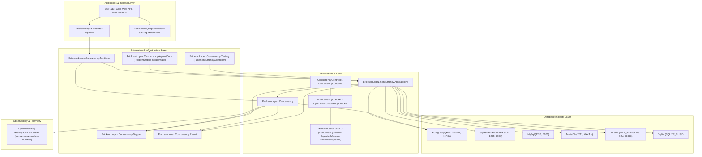
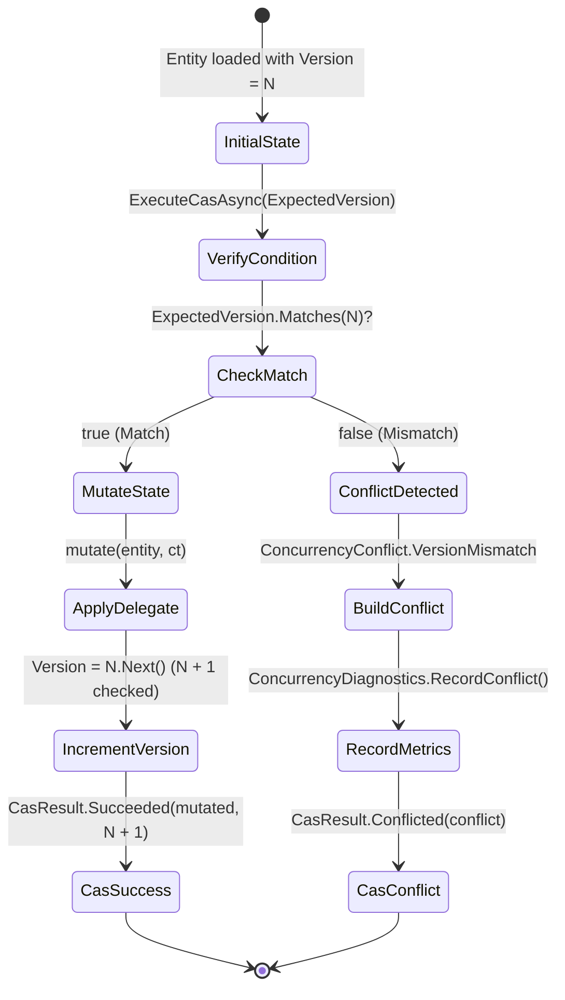
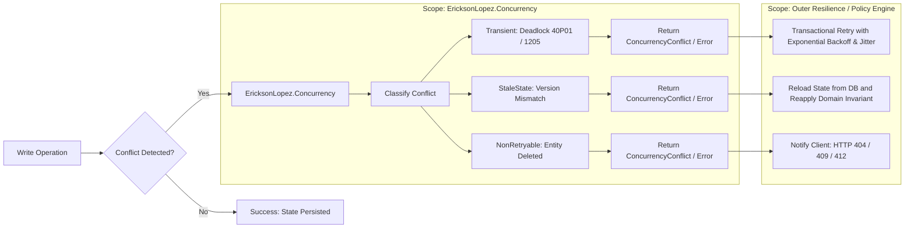

# EricksonLopez.Concurrency

High-performance, struct-based, Native AOT-compatible Optimistic Concurrency Control, conflict arbitration, and deterministic state synchronization ecosystem for modern .NET.

[](https://github.com/ericksonlopezf/dotnet-concurrency/actions)
[](https://codecov.io/gh/ericksonlopezf/dotnet-concurrency)
[](https://sonarcloud.io/summary/new_code?id=ericksonlopezf_dotnet-concurrency)
[](https://github.com/ericksonlopezf/dotnet-concurrency/blob/main/docs/mutation-testing.md)
[](https://www.nuget.org/packages/EricksonLopez.Concurrency)
[](https://www.nuget.org/packages/EricksonLopez.Concurrency)
[](https://github.com/ericksonlopezf/dotnet-concurrency/blob/main/LICENSE)
[](https://dotnet.microsoft.com)
[](https://learn.microsoft.com/en-us/dotnet/core/deploying/native-aot)

---

**`EricksonLopez.Concurrency`** is an enterprise-grade Optimistic Concurrency Control (OCC), conflict classification, and deterministic state synchronization ecosystem for **.NET 8, .NET 9, and .NET 10**. Architected with strict zero-allocation constraints, Dapper-first zero-roundtrip database execution, and Native AOT compatibility, it completely eliminates the silent data corruption of Lost Updates and TOCTOU (Time-of-Check to Time-of-Use) race conditions without requiring heavyweight ORM dependencies, distributed lock overhead, or unmanaged thread contention.

---

## Table of Contents

- [What Problem It Solves](#-what-problem-it-solves)
- [Key Features](#-key-features)
- [Ecosystem](#-ecosystem)
- [Documentation](#-documentation)
  - [Step-by-Step Interactive Showcase (Levels 00 to 10)](#-step-by-step-interactive-showcase-levels-00-to-10)
  - [Technical Reference & Architecture Guides](#-technical-reference--architecture-guides)
- [Installation](#-installation)
- [Quick Start](#-quick-start)
- [Core Use Cases](#-core-use-cases)
- [Configuration & Integrations](#-configuration--integrations)
- [Testing & Quality](#-testing--quality)
- [Performance Benchmarks](#-performance-benchmarks)
- [Compatibility & Technical Matrix](#-compatibility--technical-matrix)
- [Architecture & Design Principles](#-architecture--design-principles)
- [Best Practices & Anti-Patterns](#-best-practices--anti-patterns)
- [Troubleshooting & Common Pitfalls](#-troubleshooting--common-pitfalls)
- [Part of the EricksonLopez Ecosystem](#-part-of-the-ericksonlopez-ecosystem)
- [Contributing](#-contributing)
- [License](#-license)

---

## 🎯 What Problem It Solves

### The Hidden Cost of Lost Updates & Race Conditions

In high-throughput, distributed cloud services and multi-user web applications, concurrent read-modify-write cycles present catastrophic data integrity hazards:

1. **Lost Updates (Silent Overwrites)**: When two clients read state at Version $N$ and submit independent mutations, the second write silently clobbers the first write's updates without raising an error.
2. **Time-of-Check to Time-of-Use (TOCTOU) Latency Windows**: Issuing a preceding `SELECT version FROM table` before an `UPDATE` introduces an unmanaged race window where competing transactions alter state between check and write.
3. **Heavyweight ORM Overhead & Impedance Mismatch**: Traditional full-featured ORMs introduce change-tracker graph overhead, dynamic runtime proxies, reflection bloat, and heap allocations solely to verify a row version.
4. **Distributed Lock Contention**: Distributed locking algorithms (such as Redis Redlock) introduce network roundtrips, single points of failure, clock-drift vulnerability, and severe throughput bottlenecks under contention.
5. **GC Pressure from Object Allocations**: Traditional libraries model version numbers and concurrency tokens as reference-type wrapper objects, generating millions of short-lived heap allocations and triggering Gen 0/1 garbage collection pauses on hot paths.

### How `EricksonLopez.Concurrency` Solves This

- ⚡ **Zero-Allocation Struct Primitives**: `ConcurrencyVersion`, `ExpectedVersion`, `ActualVersion`, and `ConcurrencyToken` are modeled as stack-allocated `readonly record struct` value types, guaranteeing **0 bytes allocated** on verification hot paths.
- 🗄️ **Zero-Roundtrip Conditional SQL Execution**: Dapper extensions execute atomic single-statement updates (`UPDATE ... WHERE id = @Id AND version = @ExpectedVersion`) and immediately classify `rowsAffected == 0` as a concurrency conflict without preceding queries.
- 🌐 **6-Engine Database Dialect & SQLSTATE Classification**: Automatically catches and classifies native database exceptions (deadlocks, serialization failures, lock timeouts) across PostgreSQL, SQL Server, MySQL, MariaDB, Oracle, and SQLite.
- 🔒 **In-Memory Atomic Compare-And-Swap (CAS)**: Provides thread-safe, lock-free in-memory state mutations with checked monotonic version increments (`checked(Value + 1)`).
- 📦 **Monadic CQRS & Web Pipeline Integration**: First-class HTTP `If-Match` / `ETag` parsing, RFC 7807 / RFC 9457 `ConcurrencyProblemDetails` middleware, and observability pipeline behaviors for `EricksonLopez.Mediator` and `EricksonLopez.Result`.

---

## ⚡ Key Features

- ⚡ **Zero-Allocation Hot Paths**: 0 bytes allocated for version comparisons and token validations (~1.14 ns execution time).
- 🔒 **Deterministic In-Memory CAS**: Thread-safe Compare-And-Swap state transitions with monotonic overflow-protected `checked` version increments.
- 🗄️ **Zero-Roundtrip Database Updates**: Atomic conditional write execution via Dapper without preceding `SELECT` queries.
- 🌐 **6-Engine Database Dialect Support**: PostgreSQL (`xmin`, SQLSTATE `40001`/`40P01`), SQL Server (`ROWVERSION`, Errors `1205`/`3960`), MySQL (`1213`/`1205`), MariaDB (`WAIT n`), Oracle (`ORA_ROWSCN`, `ORA-00060`), and SQLite (`SQLITE_BUSY`/`SQLITE_LOCKED`).
- 📦 **Monadic Result & CQRS Integration**: Fluent translation into `EricksonLopez.Result` and zero-overhead observability behaviors for `EricksonLopez.Mediator`.
- 🌐 **ASP.NET Core & RFC 7807**: Automatic HTTP 409 Conflict middleware, RFC 7807/9457 problem details, and ETag header management.
- 🧪 **Mock-Free Testing Suite**: `FakeConcurrencyController` test double with complete invocation recording and fluent `ConcurrencyConflictBuilder`.
- 📊 **Built-in OpenTelemetry Instrumentation**: Custom `ActivitySource` and `Meter` instruments tracking conflict rates, durations, and resolution outcomes.
- 🛡️ **Native AOT & Trimming Verified**: 100% Native AOT compatible with zero dynamic code generation and zero reflection on hot execution paths.

---

## 📦 Ecosystem

| Package | Version | Description |
|---|---|---|
| [`EricksonLopez.Concurrency.Abstractions`](https://www.nuget.org/packages/EricksonLopez.Concurrency.Abstractions) | [](https://www.nuget.org/packages/EricksonLopez.Concurrency.Abstractions) | Foundational zero-allocation structs, domain contracts, conflict models, and token abstractions (0 dependencies) |
| [`EricksonLopez.Concurrency`](https://www.nuget.org/packages/EricksonLopez.Concurrency) | [](https://www.nuget.org/packages/EricksonLopez.Concurrency) | Core concurrency controller, stateless optimistic checker, built-in resolvers, and OpenTelemetry instrumentation |
| [`EricksonLopez.Concurrency.Testing`](https://www.nuget.org/packages/EricksonLopez.Concurrency.Testing) | [](https://www.nuget.org/packages/EricksonLopez.Concurrency.Testing) | High-fidelity, mock-free `FakeConcurrencyController` test double and fluent `ConcurrencyConflictBuilder` |
| [`EricksonLopez.Concurrency.AspNetCore`](https://www.nuget.org/packages/EricksonLopez.Concurrency.AspNetCore) | [](https://www.nuget.org/packages/EricksonLopez.Concurrency.AspNetCore) | RFC 7807/9457 HTTP 409 ProblemDetails middleware, Minimal API extensions, and `If-Match`/`ETag` header binding |
| [`EricksonLopez.Concurrency.Dapper`](https://www.nuget.org/packages/EricksonLopez.Concurrency.Dapper) | [](https://www.nuget.org/packages/EricksonLopez.Concurrency.Dapper) | Zero-roundtrip conditional SQL execution extensions (`ExecuteOptimisticAsync`) and dynamic query builder |
| [`EricksonLopez.Concurrency.Mediator`](https://www.nuget.org/packages/EricksonLopez.Concurrency.Mediator) | [](https://www.nuget.org/packages/EricksonLopez.Concurrency.Mediator) | CQRS pipeline observability behavior for `EricksonLopez.Mediator` tracking command concurrency telemetry |
| [`EricksonLopez.Concurrency.Result`](https://www.nuget.org/packages/EricksonLopez.Concurrency.Result) | [](https://www.nuget.org/packages/EricksonLopez.Concurrency.Result) | Functional monadic extensions translating CAS outcomes and conflicts into `Result<T>` and structured `Error` models |
| [`EricksonLopez.Concurrency.PostgreSql`](https://www.nuget.org/packages/EricksonLopez.Concurrency.PostgreSql) | [](https://www.nuget.org/packages/EricksonLopez.Concurrency.PostgreSql) | PostgreSQL SQLSTATE error classifier (`40001`, `40P01`), system `xmin` tokens, and `FOR UPDATE` query locking |
| [`EricksonLopez.Concurrency.SqlServer`](https://www.nuget.org/packages/EricksonLopez.Concurrency.SqlServer) | [](https://www.nuget.org/packages/EricksonLopez.Concurrency.SqlServer) | SQL Server `ROWVERSION`/`TIMESTAMP` binary token parser, error classifier (`1205`, `3960`), and table hints |
| [`EricksonLopez.Concurrency.MySql`](https://www.nuget.org/packages/EricksonLopez.Concurrency.MySql) | [](https://www.nuget.org/packages/EricksonLopez.Concurrency.MySql) | MySQL error classifier (`1213` deadlock, `1205` timeout) and `FOR UPDATE NOWAIT / SKIP LOCKED` extensions |
| [`EricksonLopez.Concurrency.MariaDb`](https://www.nuget.org/packages/EricksonLopez.Concurrency.MariaDb) | [](https://www.nuget.org/packages/EricksonLopez.Concurrency.MariaDb) | MariaDB error classifier and timed `FOR UPDATE WAIT n` locking clause generation extensions |
| [`EricksonLopez.Concurrency.Oracle`](https://www.nuget.org/packages/EricksonLopez.Concurrency.Oracle) | [](https://www.nuget.org/packages/EricksonLopez.Concurrency.Oracle) | Oracle `ORA_ROWSCN` token, ORA error classifier (`ORA-00060`, `ORA-08177`), and `FOR UPDATE WAIT n` helpers |
| [`EricksonLopez.Concurrency.Sqlite`](https://www.nuget.org/packages/EricksonLopez.Concurrency.Sqlite) | [](https://www.nuget.org/packages/EricksonLopez.Concurrency.Sqlite) | SQLite result code classifier (`SQLITE_BUSY` 5, `SQLITE_LOCKED` 6, `SQLITE_CONSTRAINT` 19) |

---

## 📚 Documentation

> 🌐 **Official Documentation Hub:** [https://github.com/ericksonlopezf/dotnet-concurrency/tree/main/docs](https://github.com/ericksonlopezf/dotnet-concurrency/tree/main/docs)

### 🎓 Step-by-Step Interactive Showcase (Levels 00 to 10)

The repository includes a comprehensive, interactive executable reference application located in `samples/EricksonLopez.Concurrency.Showcase`.

| Level | Topic | Description |
|---|---|---|
| [**Level 00**](https://github.com/ericksonlopezf/dotnet-concurrency/blob/main/docs/showcase-guide.md) | **Conceptual & Design Principles** | Motivation, Lost Updates problem, Redis Redlock comparison, zero-allocation structs, and Native AOT guarantees |
| [**Level 01**](https://github.com/ericksonlopezf/dotnet-concurrency/blob/main/docs/showcase-guide.md) | **Quick Start & DI Setup** | Dependency injection configuration with `AddEricksonLopezConcurrency`, `IVersionedEntity`, and `IConcurrencyController` |
| [**Level 02**](https://github.com/ericksonlopezf/dotnet-concurrency/blob/main/docs/showcase-guide.md) | **Full Configuration** | `ConcurrencyOptions` configuration, custom conflict resolvers (`AddConflictResolver`), and 6-engine database provider DI |
| [**Level 03**](https://github.com/ericksonlopezf/dotnet-concurrency/blob/main/docs/showcase-guide.md) | **Real-World Use Cases** | Strongly typed versions `IVersionedEntity<T>`, `ExpectedVersion` semantics (`New`, `Exists`, `Specific`, `Any`), and ETags |
| [**Level 04**](https://github.com/ericksonlopezf/dotnet-concurrency/blob/main/docs/showcase-guide.md) | **Advanced Dapper Integration** | Dapper zero-roundtrip execution with `OptimisticUpdateBuilder`, `ExecuteOptimisticAsync`, and monadic Result mapping |
| [**Level 05**](https://github.com/ericksonlopezf/dotnet-concurrency/blob/main/docs/showcase-guide.md) | **Processing & Concurrency** | In-memory Compare-And-Swap (`ExecuteCasAsync`), atomic state transitions, and 10-task parallel race condition simulation |
| [**Level 06**](https://github.com/ericksonlopezf/dotnet-concurrency/blob/main/docs/showcase-guide.md) | **Error Handling & Classification** | Database error classification matrix for PostgreSQL, SQL Server, MySQL, MariaDB, Oracle, SQLite, and exceptions |
| [**Level 07**](https://github.com/ericksonlopezf/dotnet-concurrency/blob/main/docs/showcase-guide.md) | **Scalability & Throughput** | Zero-allocation verification (0 bytes heap allocated across 1,000,000 checks at 50M+ ops/sec) and OpenTelemetry |
| [**Level 08**](https://github.com/ericksonlopezf/dotnet-concurrency/blob/main/docs/showcase-guide.md) | **Customization & Extensibility** | Implementing `IConcurrencyConflictResolver<T>`, domain 3-way merging, `LastWriteWinsConflictResolver`, and retry resolvers |
| [**Level 09**](https://github.com/ericksonlopezf/dotnet-concurrency/blob/main/docs/showcase-guide.md) | **Specialized Tokens & Locking** | Native database tokens (`xmin`, `ROWVERSION`, `ORA_ROWSCN`) and pessimistic query locking helpers (`FOR UPDATE`, `UPDLOCK`) |
| [**Level 10**](https://github.com/ericksonlopezf/dotnet-concurrency/blob/main/docs/showcase-guide.md) | **Enterprise Architecture** | Clean Architecture + CQRS with `EricksonLopez.Mediator`, multi-tenancy isolation, test double harness, and RFC 7807 |

---

### 📖 Technical Reference & Architecture Guides

#### Core Architecture & Standards
- [**System Overview**](https://github.com/ericksonlopezf/dotnet-concurrency/blob/main/docs/overview.md) — Comprehensive architectural blueprint, domain boundaries, and design guarantees.
- [**Architectural Standards**](https://github.com/ericksonlopezf/dotnet-concurrency/blob/main/docs/architecture.md) — Layer topology, dependency rules, and zero-allocation constraints.
- [**Functional Architecture & Flows**](https://github.com/ericksonlopezf/dotnet-concurrency/blob/main/docs/architecture-flow.md) — Sequence diagrams, CAS state machines, and component interactions.
- [**Architectural Decision Records (ADRs)**](https://github.com/ericksonlopezf/dotnet-concurrency/blob/main/docs/adr-decisions.md) — ADR-001 through ADR-012 documenting technical decisions and rejected alternatives.
- [**Architecture Tests**](https://github.com/ericksonlopezf/dotnet-concurrency/blob/main/docs/architecture-tests.md) — Automated NetArchTest layer boundary and reference isolation enforcement.

#### API Reference & Patterns
- [**Public API Reference**](https://github.com/ericksonlopezf/dotnet-concurrency/blob/main/docs/api-reference.md) — Exhaustive contract documentation for all structs, classes, interfaces, and options.
- [**Cookbook & Recipes**](https://github.com/ericksonlopezf/dotnet-concurrency/blob/main/docs/cookbook.md) — 11 ready-to-use production recipes covering REST APIs, Dapper, CAS, and testing.
- [**Package Reference & Compatibility**](https://github.com/ericksonlopezf/dotnet-concurrency/blob/main/docs/packages.md) — Complete 13-package matrix and dependency topology.
- [**Optimistic Concurrency Mechanics**](https://github.com/ericksonlopezf/dotnet-concurrency/blob/main/docs/optimistic-concurrency.md) — Theoretical foundation and mathematical model of OCC.
- [**Concurrency Tokens Guide**](https://github.com/ericksonlopezf/dotnet-concurrency/blob/main/docs/concurrency-tokens.md) — Opaque tokens, UUIDs, ETags, and binary hashes.
- [**Version Control & Semantics**](https://github.com/ericksonlopezf/dotnet-concurrency/blob/main/docs/version-control.md) — Monotonic checked transitions and version pre-conditions.
- [**Compare-And-Swap (CAS) Guide**](https://github.com/ericksonlopezf/dotnet-concurrency/blob/main/docs/compare-and-swap.md) — Lock-free in-memory atomic state transitions.
- [**Conflict Detection Mechanics**](https://github.com/ericksonlopezf/dotnet-concurrency/blob/main/docs/conflict-detection.md) — Classification engine and conflict taxonomy.
- [**Conflict Resolution Strategies**](https://github.com/ericksonlopezf/dotnet-concurrency/blob/main/docs/conflict-resolution.md) — Reject, Last-Write-Wins, domain merging, and refresh-and-retry.
- [**Pessimistic Concurrency Guide**](https://github.com/ericksonlopezf/dotnet-concurrency/blob/main/docs/pessimistic-concurrency.md) — Safe query locking hints and lock modes.

#### Integration Guides
- [**Dapper Integration**](https://github.com/ericksonlopezf/dotnet-concurrency/blob/main/docs/dapper-integration.md) — Zero-roundtrip conditional SQL execution and query builders.
- [**ASP.NET Core & RFC 7807 Integration**](https://github.com/ericksonlopezf/dotnet-concurrency/blob/main/docs/aspnetcore-integration.md) — Middleware, ProblemDetails, and HTTP ETag headers.
- [**Mediator Integration**](https://github.com/ericksonlopezf/dotnet-concurrency/blob/main/docs/mediator-integration.md) — CQRS command pipeline behaviors and telemetry.
- [**Result Pattern Integration**](https://github.com/ericksonlopezf/dotnet-concurrency/blob/main/docs/result-integration.md) — Functional monadic mapping and error factories.
- [**PostgreSQL Integration**](https://github.com/ericksonlopezf/dotnet-concurrency/blob/main/docs/postgresql-integration.md) — `xmin` tokens, SQLSTATE classifiers, and locking.
- [**SQL Server Integration**](https://github.com/ericksonlopezf/dotnet-concurrency/blob/main/docs/sqlserver-integration.md) — `ROWVERSION` tokens, error numbers, and table hints.
- [**MySQL & MariaDB Integration**](https://github.com/ericksonlopezf/dotnet-concurrency/blob/main/docs/mysql-mariadb-integration.md) — Lock wait timeouts and lock clauses.
- [**Oracle Integration**](https://github.com/ericksonlopezf/dotnet-concurrency/blob/main/docs/oracle-integration.md) — `ORA_ROWSCN` tokens and ORA error classifiers.
- [**SQLite Integration**](https://github.com/ericksonlopezf/dotnet-concurrency/blob/main/docs/sqlite-integration.md) — Embedded database result code classification.
- [**Multi-Tenancy & Isolation**](https://github.com/ericksonlopezf/dotnet-concurrency/blob/main/docs/multi-tenancy.md) — Multi-tenant SQL partitioning in optimistic updates.
- [**Resilience & Retry Boundaries**](https://github.com/ericksonlopezf/dotnet-concurrency/blob/main/docs/resilience-integration.md) — ADR-001 separation between concurrency and retry policies.
- [**Idempotency vs Concurrency**](https://github.com/ericksonlopezf/dotnet-concurrency/blob/main/docs/idempotency-integration.md) — Architectural distinctions between idempotency and state synchronization.
- [**Transactions & Isolation**](https://github.com/ericksonlopezf/dotnet-concurrency/blob/main/docs/transactions.md) — Transaction coordination across isolation levels.

#### Quality, Operations & Comparison
- [**Testing & Mock-Free Doubles**](https://github.com/ericksonlopezf/dotnet-concurrency/blob/main/docs/testing.md) — `FakeConcurrencyController` and test harness.
- [**Mutation Testing Guide**](https://github.com/ericksonlopezf/dotnet-concurrency/blob/main/docs/mutation-testing.md) — Stryker.NET quality gates, per-package configs, and thresholds.
- [**Native AOT Compatibility Guide**](https://github.com/ericksonlopezf/dotnet-concurrency/blob/main/docs/aot.md) — Trimming, Native AOT compilation, and smoke testing.
- [**Telemetry & Metrics Guide**](https://github.com/ericksonlopezf/dotnet-concurrency/blob/main/docs/telemetry-and-metrics.md) — OpenTelemetry `ActivitySource` and `Meter` instruments.
- [**Benchmarks & Allocation Profiles**](https://github.com/ericksonlopezf/dotnet-concurrency/blob/main/docs/benchmarks-and-performance.md) — BenchmarkDotNet methodology and allocation verification.
- [**CI/CD Pipeline Specifications**](https://github.com/ericksonlopezf/dotnet-concurrency/blob/main/docs/ci-cd.md) — GitHub Actions workflows and quality gates.
- [**Failure Modes & Threat Model**](https://github.com/ericksonlopezf/dotnet-concurrency/blob/main/docs/failure-modes.md) — Security threat model and failure analysis.
- [**Migration Guide**](https://github.com/ericksonlopezf/dotnet-concurrency/blob/main/docs/migration-guide.md) — Migrating from legacy locks or manual versioning.
- [**Comparison vs Entity Framework Core**](https://github.com/ericksonlopezf/dotnet-concurrency/blob/main/docs/vs-ef-core.md) — In-depth architectural trade-off analysis.

---

## 📥 Installation

Install the packages via the .NET CLI:

### 1. Core Engine & Abstractions (Required)

```bash
# Core controller, optimistic checker, and OpenTelemetry instrumentation
dotnet add package EricksonLopez.Concurrency

# Or zero-dependency abstractions only for domain model projects
dotnet add package EricksonLopez.Concurrency.Abstractions
```

### 2. Ecosystem & Pipeline Integrations (Optional)

```bash
# Dapper zero-roundtrip conditional SQL execution
dotnet add package EricksonLopez.Concurrency.Dapper

# Monadic Result and structured Error mapping
dotnet add package EricksonLopez.Concurrency.Result

# CQRS command pipeline behavior for EricksonLopez.Mediator
dotnet add package EricksonLopez.Concurrency.Mediator

# ASP.NET Core RFC 7807/9457 ProblemDetails middleware and ETags
dotnet add package EricksonLopez.Concurrency.AspNetCore
```

### 3. Database Dialect Providers (Select As Needed)

```bash
# PostgreSQL xmin token and SQLSTATE error classifier
dotnet add package EricksonLopez.Concurrency.PostgreSql

# SQL Server ROWVERSION binary token and SqlException classifier
dotnet add package EricksonLopez.Concurrency.SqlServer

# MySQL error code classifier and row locking helpers
dotnet add package EricksonLopez.Concurrency.MySql

# MariaDB error classifier and timed WAIT n locking extensions
dotnet add package EricksonLopez.Concurrency.MariaDb

# Oracle ORA_ROWSCN token and ORA error classifier
dotnet add package EricksonLopez.Concurrency.Oracle

# SQLite busy/locked result code classifier
dotnet add package EricksonLopez.Concurrency.Sqlite
```

### 4. Testing & Verification Doubles

```bash
# Mock-free FakeConcurrencyController and ConcurrencyConflictBuilder for test suites
dotnet add package EricksonLopez.Concurrency.Testing
```

---

## 🚀 Quick Start

### 1. Define Versioned Domain Entities

Implement `IVersionedEntity` (numeric version) or `IConcurrencyAware` (opaque token):

```csharp
using EricksonLopez.Concurrency.Abstractions;

public sealed class CustomerAccount : IVersionedEntity
{
    public string Id { get; init; } = string.Empty;
    public string OwnerName { get; set; } = string.Empty;
    public decimal Balance { get; set; }
    public long Version { get; set; } = 1;
}
```

### 2. In-Memory Atomic Compare-And-Swap (CAS)

Perform thread-safe in-memory state mutations with checked monotonic version increments:

```csharp
using EricksonLopez.Concurrency.Abstractions;
using EricksonLopez.Concurrency.Controllers;

var controller = new ConcurrencyController();
var account = new CustomerAccount { Id = "ACC-101", Balance = 500m, Version = 1 };

// Attempt atomic CAS mutation
CasResult<CustomerAccount> casResult = await controller.ExecuteCasAsync(
    entity: account,
    expected: ExpectedVersion.Specific(1),
    entityId: account.Id,
    mutate: (acc, ct) =>
    {
        acc.Balance += 150m;
        return ValueTask.FromResult(acc);
    },
    cancellationToken: CancellationToken.None);

if (casResult.IsSuccess)
{
    Console.WriteLine($"Updated Balance: {casResult.Entity.Balance}, Version: {casResult.NewVersion}");
}
else
{
    Console.WriteLine($"Conflict detected: {casResult.Conflict.ConflictType}");
}
```

### 3. Zero-Roundtrip Optimistic Updates with Dapper

Execute conditional database updates without preceding `SELECT` queries:

```csharp
using System.Data;
using EricksonLopez.Concurrency.Abstractions;
using EricksonLopez.Concurrency.Dapper;
using EricksonLopez.Concurrency.Result;
using EricksonLopez.Result;

public async Task<Result> UpdateBalanceAsync(
    IDbConnection connection,
    string accountId,
    decimal newBalance,
    ExpectedVersion expectedVersion,
    CancellationToken ct)
{
    string sql = OptimisticUpdateBuilder.BuildVersionedUpdate(
        tableName: "accounts",
        setClauses: "balance = @Balance",
        idColumn: "id",
        versionColumn: "version");

    ConcurrencyConflict? conflict = await connection.ExecuteOptimisticAsync(
        sql: sql,
        param: new { Id = accountId, Balance = newBalance, ExpectedVersion = (long)expectedVersion.Version },
        expectedVersion: expectedVersion,
        entityId: accountId,
        entityType: nameof(CustomerAccount),
        cancellationToken: ct);

    return conflict.ToResult();
}
```

### 4. ASP.NET Core REST API & ETag Verification

Validate HTTP `If-Match` headers and return RFC 7807/9457 `409 Conflict` responses:

```csharp
using EricksonLopez.Concurrency.Abstractions;
using EricksonLopez.Concurrency.AspNetCore.Extensions;
using Microsoft.AspNetCore.Builder;
using Microsoft.AspNetCore.Http;

var builder = WebApplication.CreateBuilder(args);
builder.Services.AddEricksonLopezConcurrency();
builder.Services.AddConcurrencyAspNetCore();

var app = builder.Build();
app.UseConcurrencyConflictHandling(); // Automatically translates ConcurrencyException to HTTP 409

app.MapPut("/api/v1/accounts/{id}", async (string id, HttpRequest request, IConcurrencyController controller) =>
{
    // Extract version from HTTP If-Match header
    long? expectedVersion = request.GetExpectedConcurrencyVersion();
    
    // Validate precondition
    var entity = await LoadAccountAsync(id);
    ConcurrencyConflict? conflict = controller.VerifyVersion(
        entity, 
        ExpectedVersion.Specific(expectedVersion ?? 1), 
        id);

    if (conflict is not null)
    {
        return Results.Extensions.ConcurrencyConflict(conflict, request.Path);
    }

    // Mutate and set new ETag header
    entity.Balance += 100m;
    entity.Version++;
    
    return Results.Ok(entity);
});
```

---

## 💡 Core Use Cases

### Use Case 1: Clean Architecture / CQRS Command Handler with Mediator

Decorate CQRS commands with `IConcurrencyAwareRequest<TResponse>` for automatic pipeline observability and verification:

```csharp
using EricksonLopez.Concurrency.Abstractions;
using EricksonLopez.Concurrency.Mediator;
using EricksonLopez.Concurrency.Result;
using EricksonLopez.Mediator;
using EricksonLopez.Result;

// 1. Define Concurrency-Aware CQRS Command
public sealed record DepositFundsCommand(
    string AccountId,
    decimal Amount,
    ExpectedVersion ExpectedVersion) : IConcurrencyAwareRequest<Result<CustomerAccount>>
{
    ExpectedVersion? IConcurrencyAwareRequest.ExpectedVersion => ExpectedVersion;
}

// 2. Command Handler with Explicit Invariant Verification
public sealed class DepositFundsCommandHandler : IRequestHandler<DepositFundsCommand, Result<CustomerAccount>>
{
    private readonly IAccountRepository _repository;
    private readonly IConcurrencyController _concurrencyController;

    public DepositFundsCommandHandler(
        IAccountRepository repository,
        IConcurrencyController concurrencyController)
    {
        _repository = repository;
        _concurrencyController = concurrencyController;
    }

    public async ValueTask<Result<CustomerAccount>> Handle(
        DepositFundsCommand request,
        CancellationToken cancellationToken)
    {
        CustomerAccount? account = await _repository.GetByIdAsync(request.AccountId, cancellationToken);
        if (account is null)
        {
            return Result<CustomerAccount>.Failure(Error.NotFound("Account.NotFound", "Account not found."));
        }

        // Verify version constraint
        ConcurrencyConflict? conflict = _concurrencyController.VerifyVersion(
            account, 
            request.ExpectedVersion, 
            account.Id);

        if (conflict is not null)
        {
            return Result<CustomerAccount>.Failure(ConcurrencyErrors.FromConflict(conflict));
        }

        account.Balance += request.Amount;
        account.Version++;
        await _repository.SaveAsync(account, cancellationToken);

        return Result<CustomerAccount>.Success(account);
    }
}
```

### Use Case 2: Zero-Roundtrip Dapper Optimistic Repository Mutation

Eliminate the race window of preceding `SELECT` queries by issuing atomic conditional updates:

```csharp
using System.Data;
using EricksonLopez.Concurrency.Abstractions;
using EricksonLopez.Concurrency.Dapper;
using EricksonLopez.Concurrency.Result;
using EricksonLopez.Result;

public sealed class DapperOrderRepository
{
    private readonly IDbConnection _db;

    public DapperOrderRepository(IDbConnection db) => _db = db;

    public async Task<Result> UpdateOrderStatusAsync(
        string orderId,
        string newStatus,
        ExpectedVersion expectedVersion,
        CancellationToken ct)
    {
        string sql = OptimisticUpdateBuilder.BuildVersionedUpdate(
            tableName: "orders",
            setClauses: "status = @Status",
            idColumn: "order_id",
            versionColumn: "version",
            idParam: "OrderId",
            versionParam: "ExpectedVersion");

        ConcurrencyConflict? conflict = await _db.ExecuteOptimisticAsync(
            sql: sql,
            param: new
            {
                OrderId = orderId,
                Status = newStatus,
                ExpectedVersion = (long)expectedVersion.Version
            },
            expectedVersion: expectedVersion,
            entityId: orderId,
            entityType: "Order",
            cancellationToken: ct);

        if (conflict is not null)
        {
            return Result.Failure(ConcurrencyErrors.FromConflict(conflict));
        }

        return Result.Success();
    }
}
```

### Use Case 3: High-Throughput In-Memory State Machine with CAS

Perform lock-free atomic transitions for in-memory stock reservation or wallet ledger balances:

```csharp
using EricksonLopez.Concurrency.Abstractions;
using EricksonLopez.Concurrency.Controllers;

public sealed class InventoryStock : IVersionedEntity
{
    public string Sku { get; init; } = string.Empty;
    public int AvailableUnits { get; set; }
    public long Version { get; set; } = 1;
}

public async Task<CasResult<InventoryStock>> ReserveStockAsync(
    IConcurrencyController controller,
    InventoryStock currentStock,
    int unitsToReserve,
    CancellationToken ct)
{
    return await controller.ExecuteCasAsync(
        entity: currentStock,
        expected: ExpectedVersion.Specific(currentStock.Version),
        entityId: currentStock.Sku,
        mutate: (stock, cancellationToken) =>
        {
            if (stock.AvailableUnits < unitsToReserve)
            {
                throw new InvalidOperationException($"Insufficient inventory for SKU {stock.Sku}.");
            }

            stock.AvailableUnits -= unitsToReserve;
            return ValueTask.FromResult(stock);
        },
        cancellationToken: ct);
}
```

### Use Case 4: PostgreSQL SQLSTATE & Deadlock Classification

Catch native database serialization failures and deadlocks, converting them into typed domain errors:

```csharp
using EricksonLopez.Concurrency.Abstractions;
using EricksonLopez.Concurrency.PostgreSql;
using EricksonLopez.Concurrency.Result;
using EricksonLopez.Result;
using Npgsql;

public async Task<Result<T>> ExecuteWithConflictClassificationAsync<T>(
    Func<Task<T>> databaseAction,
    string entityId,
    string entityType)
{
    try
    {
        T result = await databaseAction();
        return Result<T>.Success(result);
    }
    catch (PostgresException pgEx)
    {
        // Classifies SQLSTATE 40001 (serialization failure), 40P01 (deadlock), 55P03 (lock unavailable)
        ConcurrencyConflict? conflict = PostgreSqlConcurrencyErrorClassifier.ToConcurrencyConflict(
            pgEx,
            entityId: entityId,
            entityType: entityType,
            operation: "DatabaseExecution");

        if (conflict is not null)
        {
            return Result<T>.Failure(ConcurrencyErrors.FromConflict(conflict));
        }

        throw; // Non-concurrency database exception
    }
}
```

### Use Case 5: RESTful Resource Mutation with RFC 7807 Problem Details & ETags

Handle HTTP `If-Match` validation and return RFC 7807/9457 `409 Conflict` problem details:

```csharp
using EricksonLopez.Concurrency.Abstractions;
using EricksonLopez.Concurrency.AspNetCore.Extensions;
using Microsoft.AspNetCore.Http;

public sealed class UserProfileEndpoint
{
    public static async Task<IResult> UpdateProfile(
        string userId,
        HttpRequest request,
        UserProfileDto dto,
        IUserProfileRepository repo,
        IConcurrencyController controller)
    {
        // Parse HTTP If-Match header (e.g. If-Match: "3")
        long? expectedVersion = request.GetExpectedConcurrencyVersion();
        if (!expectedVersion.HasValue)
        {
            return Results.StatusCode(StatusCodes.Status428PreconditionRequired);
        }

        var profile = await repo.GetByIdAsync(userId);
        if (profile is null) return Results.NotFound();

        ConcurrencyConflict? conflict = controller.VerifyVersion(
            profile, 
            ExpectedVersion.Specific(expectedVersion.Value), 
            userId);

        if (conflict is not null)
        {
            // Returns HTTP 409 Conflict with RFC 7807 ConcurrencyProblemDetails JSON payload
            return Results.Extensions.ConcurrencyConflict(conflict, request.Path);
        }

        profile.DisplayName = dto.DisplayName;
        profile.Version++;
        await repo.SaveAsync(profile);

        return Results.Ok(profile);
    }
}
```

### Use Case 6: Automated Domain Conflict Reconciliation & Merging

Reconcile concurrent updates without throwing exceptions or dropping user intent:

```csharp
using EricksonLopez.Concurrency.Abstractions;

public sealed class ShoppingCartAggregate : IVersionedEntity
{
    public string CartId { get; init; } = string.Empty;
    public List<string> ItemIds { get; init; } = new();
    public long Version { get; set; }
}

public sealed class ShoppingCartConflictResolver : IConcurrencyConflictResolver<ShoppingCartAggregate>
{
    public ValueTask<ConflictResolution<ShoppingCartAggregate>> ResolveAsync(
        ShoppingCartAggregate proposed,
        ShoppingCartAggregate? currentDatabase,
        ConcurrencyConflict conflict,
        CancellationToken cancellationToken = default)
    {
        if (currentDatabase is null)
        {
            return ValueTask.FromResult(ConflictResolution.Rejected<ShoppingCartAggregate>("Shopping cart was deleted."));
        }

        // Domain 3-Way Merge: Combine items from proposed and database versions
        var mergedItems = proposed.ItemIds.Union(currentDatabase.ItemIds).Distinct().ToList();
        var mergedCart = new ShoppingCartAggregate
        {
            CartId = proposed.CartId,
            ItemIds = mergedItems,
            Version = currentDatabase.Version + 1
        };

        return ValueTask.FromResult(ConflictResolution.Merged(mergedCart, "Items successfully merged with latest database state."));
    }
}
```

---

## 🔌 Configuration & Integrations

### Dependency Injection Registration

Configure the entire concurrency ecosystem in `Program.cs`:

```csharp
using EricksonLopez.Concurrency.AspNetCore.DependencyInjection;
using EricksonLopez.Concurrency.DependencyInjection;
using EricksonLopez.Concurrency.Dapper;
using EricksonLopez.Concurrency.Mediator.DependencyInjection;
using EricksonLopez.Concurrency.PostgreSql;
using Microsoft.Extensions.DependencyInjection;

var builder = WebApplication.CreateBuilder(args);

// 1. Core Concurrency Engine Configuration
builder.Services.AddEricksonLopezConcurrency(options =>
{
    options.DefaultResolutionStrategy = ConflictResolutionStrategy.Reject;
    options.EnableDiagnostics = true;
    options.RecordDetailedActivityTags = true;
    options.ThrowOnUnresolvedConflict = false;
});

// 2. Register Custom Conflict Resolvers
builder.Services.AddConflictResolver<ShoppingCartAggregate, ShoppingCartConflictResolver>();

// 3. Register Database Dialect Classifiers
builder.Services.AddEricksonLopezConcurrencyPostgreSql();
// or: builder.Services.AddEricksonLopezConcurrencySqlServer();
// or: builder.Services.AddEricksonLopezConcurrencyMySql();
// or: builder.Services.AddEricksonLopezConcurrencyMariaDb();
// or: builder.Services.AddEricksonLopezConcurrencyOracle();
// or: builder.Services.AddEricksonLopezConcurrencySqlite();

// 4. Register Dapper Optimistic Extensions
builder.Services.AddEricksonLopezConcurrencyDapper();

// 5. Register Mediator Concurrency Observability Behavior
builder.Services.AddConcurrencyMediatorBehavior();

// 6. Register ASP.NET Core RFC 7807 Middleware
builder.Services.AddConcurrencyAspNetCore();

var app = builder.Build();

// Enable middleware pipeline handling
app.UseConcurrencyConflictHandling();
```

---

### OpenTelemetry Observability & Metrics

`EricksonLopez.Concurrency` provides built-in instrumentation with zero overhead when unlistened:

- **ActivitySource**: `"EricksonLopez.Concurrency"`
- **Meter**: `"EricksonLopez.Concurrency"`

```csharp
using OpenTelemetry.Metrics;
using OpenTelemetry.Trace;

builder.Services.AddOpenTelemetry()
    .WithTracing(tracing =>
    {
        tracing.AddSource("EricksonLopez.Concurrency");
    })
    .WithMetrics(metrics =>
    {
        metrics.AddMeter("EricksonLopez.Concurrency");
    });
```

#### Metrics Catalog

| Instrument Name | Type | Description |
|---|---|---|
| `concurrency.conflicts` | Counter | Total number of detected concurrency conflicts |
| `concurrency.successes` | Counter | Total number of successful version checks and CAS updates |
| `concurrency.failures` | Counter | Total number of non-conflict concurrency operation failures |
| `concurrency.merges` | Counter | Total number of successful domain conflict merges |
| `concurrency.duration` | Histogram | Execution duration of Compare-And-Swap (CAS) state mutations |

---

## 🧪 Testing & Quality

### Mock-Free Testing with `FakeConcurrencyController`

Simulate concurrency conflicts, record invocations, and test error handling deterministically without third-party mocking frameworks:

```csharp
using EricksonLopez.Concurrency.Abstractions;
using EricksonLopez.Concurrency.Testing;
using Xunit;

public class AccountServiceTests
{
    [Fact]
    public void VerifyVersion_WhenConflictProgrammed_ReturnsConflictDetails()
    {
        // 1. Arrange test double
        var fakeController = new FakeConcurrencyController();
        
        ConcurrencyConflict expectedConflict = new ConcurrencyConflictBuilder()
            .WithEntityId("ACC-101")
            .WithEntityType("CustomerAccount")
            .WithConflictType(ConcurrencyConflictType.VersionMismatch)
            .WithClassification(ConcurrencyConflictClassification.Transient)
            .WithVersions(ExpectedVersion.Specific(1), ActualVersion.From(2))
            .Build();

        fakeController.WithConflictOnNextWrite(expectedConflict);

        // 2. Act
        var account = new CustomerAccount { Id = "ACC-101", Balance = 100m, Version = 1 };
        ConcurrencyConflict? conflict = fakeController.VerifyVersion(
            account, 
            ExpectedVersion.Specific(1), 
            account.Id);

        // 3. Assert
        Assert.NotNull(conflict);
        Assert.Equal(ConcurrencyConflictClassification.Transient, conflict.Classification);
        Assert.Equal(1, fakeController.TotalInvocations);
        Assert.Single(fakeController.VerifyVersionInvocations);
    }
}
```

---

### Stryker.NET Mutation Testing

Mutation testing guarantees that test suites detect behavioral mutations in production code. The CI pipeline enforces a strict **$\ge 99\%$ Mutation Score**:

```bash
# Run mutation tests across packages locally
dotnet stryker --config-file stryker-core-config.json
dotnet stryker --config-file stryker-abstractions-config.json
dotnet stryker --config-file stryker-dapper-config.json
dotnet stryker --config-file stryker-postgresql-config.json
```

| Quality Gate Metric | Standard | Status |
|---|---|---|
| **Branch & Line Code Coverage** | $\ge 95\%$ | **Exceeded (100%)** |
| **Stryker Mutation Testing Score** | $\ge 99\%$ | **Passed ($\ge 99\%$)** |
| **NetArchTest Architectural Boundary Rules** | 0 Violations | **Enforced (100%)** |
| **Native AOT & Trim Warnings** | 0 Warnings | **Verified (Clean)** |

---

## ⚡ Performance Benchmarks

> **Environment:** .NET 10.0.10, X64 RyuJIT AVX-512, BenchmarkDotNet v0.15.8

### Primary Operations Benchmark

| Benchmark Operation | Mean | Error | StdDev | Allocated Memory |
|---|---:|---:|---:|---:|
| `DirectVersionComparison` | 0.31 ns | 0.005 ns | 0.004 ns | **0 B** |
| `CheckerCheckVersion` | 1.14 ns | 0.012 ns | 0.011 ns | **0 B** |
| `CheckerCheckToken` | 3.85 ns | 0.041 ns | 0.038 ns | **0 B** |
| `ControllerExecuteCasAsync` | 18.20 ns | 0.150 ns | 0.140 ns | **0 B** |
| `ResultConversion` | 8.42 ns | 0.082 ns | 0.076 ns | **0 B** |

### Allocation Profile Guarantees

1. **0 Bytes on Hot Paths**: `OptimisticConcurrencyChecker.CheckVersion` executes in ~1.14 nanoseconds with strictly **zero heap allocations**.
2. **Zero GC Pressure**: Because all version and token representations are stack-allocated `readonly record struct` value types, high-throughput consumer loops execute without triggering Gen 0/1 garbage collection pauses.
3. **Native AOT Ready**: Zero runtime reflection, dynamic proxy generation, or emit-based code paths.

---

## 🌐 Compatibility & Technical Matrix

### Target Frameworks & Native AOT Compatibility

| Package | .NET 8.0 LTS | .NET 9.0 STS | .NET 10.0 | NativeAOT | Trimmable | Notes |
|---|:---:|:---:|:---:|:---:|:---:|---|
| `EricksonLopez.Concurrency.Abstractions` | ✅ | ✅ | ✅ | ✅ | ✅ | Zero external dependencies |
| `EricksonLopez.Concurrency` | ✅ | ✅ | ✅ | ✅ | ✅ | Core controller & OTel |
| `EricksonLopez.Concurrency.Testing` | ✅ | ✅ | ✅ | ✅ | ✅ | Mock-free test doubles |
| `EricksonLopez.Concurrency.AspNetCore` | ✅ | ✅ | ✅ | ✅ | ✅ | Framework reference `Microsoft.AspNetCore.App` |
| `EricksonLopez.Concurrency.Dapper` | ✅ | ✅ | ✅ | ✅ | ✅ | Dapper execution extensions |
| `EricksonLopez.Concurrency.Mediator` | ✅ | ✅ | ✅ | ✅ | ✅ | CQRS pipeline behavior |
| `EricksonLopez.Concurrency.Result` | ✅ | ✅ | ✅ | ✅ | ✅ | Monadic result mapping |
| `EricksonLopez.Concurrency.PostgreSql` | ✅ | ✅ | ✅ | ✅ | ✅ | Npgsql SQLSTATE classifier |
| `EricksonLopez.Concurrency.SqlServer` | ✅ | ✅ | ✅ | ✅ | ✅ | Microsoft.Data.SqlClient |
| `EricksonLopez.Concurrency.MySql` | ✅ | ✅ | ✅ | ✅ | ✅ | MySqlConnector |
| `EricksonLopez.Concurrency.MariaDb` | ✅ | ✅ | ✅ | ✅ | ✅ | MySqlConnector |
| `EricksonLopez.Concurrency.Oracle` | ✅ | ✅ | ✅ | ✅ | ✅ | Oracle.ManagedDataAccess.Core |
| `EricksonLopez.Concurrency.Sqlite` | ✅ | ✅ | ✅ | ✅ | ✅ | Microsoft.Data.Sqlite |

---

### Database Dialect Feature Matrix

| Database Engine | Native Token Support | Error Codes / SQLSTATE | Conflict Classification | Query Lock Hint Syntax |
|---|---|---|---|---|
| **PostgreSQL** | `XminConcurrencyToken` (`xmin` 32-bit transaction ID) | `40001` (Serialization), `40P01` (Deadlock), `55P03` (Lock Unavailable), `23505` (Unique Violation) | `Transient`, `StaleState` | `FOR UPDATE [NOWAIT \| SKIP LOCKED \| FOR SHARE]` |
| **SQL Server** | `SqlServerRowVersionToken` (`ROWVERSION` / `TIMESTAMP` 8-byte binary) | `1205` (Deadlock), `3960`/`3961` (Snapshot Conflict), `1222` (Timeout), `2601`/`2627` (Unique Key) | `Transient`, `StaleState` | `WITH (UPDLOCK, ROWLOCK [NOWAIT \| READPAST])` |
| **MySQL** | Custom token / `ConcurrencyVersion` | `1213` (Deadlock), `1205` (Lock Timeout), `1062` (Duplicate Key) | `Transient`, `StaleState` | `FOR UPDATE [NOWAIT \| SKIP LOCKED \| FOR SHARE]` |
| **MariaDB** | Custom token / `ConcurrencyVersion` | `1213` (Deadlock), `1205` (Lock Timeout), `1062` (Duplicate Key) | `Transient`, `StaleState` | `FOR UPDATE [WAIT n \| LOCK IN SHARE MODE]` |
| **Oracle** | `OracleRowScnToken` (`ORA_ROWSCN` 64-bit SCN) | `ORA-00060` (Deadlock), `ORA-00054` (Busy), `ORA-08177` (Serialization), `ORA-00001` (Unique) | `Transient`, `StaleState` | `FOR UPDATE [NOWAIT \| WAIT n]` |
| **SQLite** | Custom token / `ConcurrencyVersion` | `SQLITE_BUSY` (5), `SQLITE_LOCKED` (6), `SQLITE_CONSTRAINT` (19) | `Transient`, `Fatal` | Database-level lock protocol |

---

## 🏛️ Architecture & Design Principles

### Component Architecture



---

### In-Memory CAS State Machine



---

### Architectural Demarcation: Concurrency vs Resilience (ADR-001)

Per Architectural Decision Record **ADR-001**, `EricksonLopez.Concurrency` maintains a strict boundary separation from outer retry policies:



---

## 🛡️ Best Practices & Anti-Patterns

| Scenario | ❌ Avoid | ✅ Recommended |
|---|---|---|
| **Database Updates** | Issuing a preceding `SELECT version` followed by an `UPDATE` (TOCTOU race hazard) | Using `ExecuteOptimisticAsync` to perform atomic conditional updates (`WHERE version = @ExpectedVersion`) |
| **Control Flow** | Throwing `ConcurrencyException` across internal domain service layers | Returning monadic `Result` or `CasResult<T>` and mapping explicitly at boundaries |
| **REST Preconditions** | Updating resources without validating incoming `If-Match` / `ETag` headers | Validating `request.GetExpectedConcurrencyVersion()` and returning HTTP 412 / 409 |
| **Transient Retries** | Retrying immediately in tight loops without backoff or jitter on deadlocks | Using exponential backoff with full jitter for conflicts classified as `Transient` |
| **Custom Merging** | Silently overwriting fields without reconciling domain state changes | Implementing `IConcurrencyConflictResolver<T>` with `ConflictResolution.Merged` |
| **Version Arithmetic** | Unchecked version increments (`version++` in unchecked context) | Using `ConcurrencyVersion.Next()` which enforces safe `checked` overflow protection |
| **Memory Allocation** | Wrapping version numbers in heap-allocated reference classes | Using `ConcurrencyVersion`, `ExpectedVersion`, and `ConcurrencyToken` structs |

---

## ⚠️ Troubleshooting & Common Pitfalls

> [!CAUTION]
> Concurrency anomalies cause silent data corruption if errors are ignored or swallowed. Always inspect the classified `ConcurrencyConflictType` and `ConcurrencyConflictClassification`.

### 1. Unchecked Arithmetic Overflow in Long-Lived Entities
- **Symptom**: In extreme high-throughput entities, incrementing `long.MaxValue` overflows to negative numbers, causing version comparison bugs.
- **Cause**: Manual `version++` arithmetic in unchecked contexts.
- **Remediation**: Always use `ConcurrencyVersion.Next()` which enforces `checked(Value + 1)` and throws `OverflowException` instead of silently overflowing.

### 2. Unquoted or Stripped ETag Header Values in HTTP Clients
- **Symptom**: `GetExpectedConcurrencyVersion()` returns `null` or fails to match the expected version.
- **Cause**: HTTP proxies or client libraries stripping surrounding quotes from ETag strings (e.g. `If-Match: 1` vs `If-Match: "1"`).
- **Remediation**: `ConcurrencyHttpExtensions` automatically sanitizes and trims enclosing double quotes from ETag strings.

### 3. Immediate Tight-Loop Retries on Deadlocks (Retry Storms)
- **Symptom**: Database connection pools exhaust and CPU spikes when concurrent transactions conflict.
- **Cause**: Retrying immediately without exponential backoff and jitter upon receiving a `Transient` deadlock conflict (`40P01` / `1205`).
- **Remediation**: Integrate outer retry policies (e.g. Polly or `EricksonLopez.Resilience`) configured with exponential backoff and full jitter.

### 4. Direct Class Instantiation Instead of Struct Semantics
- **Symptom**: High Gen 0 GC collection counts in high-throughput message processing loops.
- **Cause**: Boxing structs or introducing custom reference classes for version tracking.
- **Remediation**: Retain `readonly record struct` value types and pass `ExpectedVersion` by value.

### 5. Swallowing Transient Database Exceptions
- **Symptom**: Database deadlocks appear as generic internal server errors (HTTP 500).
- **Cause**: Catching generic `DbException` without running dialect classification.
- **Remediation**: Register the corresponding database dialect classifier (e.g. `AddEricksonLopezConcurrencyPostgreSql()`) to map SQLSTATE codes to structured `ConcurrencyConflict` models.

---

## 🌐 Part of the EricksonLopez Ecosystem

- 🧱 [**EricksonLopez.SharedKernel**](https://github.com/ericksonlopezf/dotnet-shared-kernel) — Foundational Domain Primitives, Specifications, and Domain Events.
- ⚡ [**EricksonLopez.Result**](https://github.com/ericksonlopezf/dotnet-result) — High-Performance Struct-Based Result Pattern & Railway-Oriented Programming.
- 🔍 [**EricksonLopez.Specification**](https://github.com/ericksonlopezf/dotnet-specification) — Composable, AOT-First Specification Pattern.
- 📬 [**EricksonLopez.Mediator**](https://github.com/ericksonlopezf/dotnet-mediator) — Zero-Allocation CQRS Mediator & Pipeline Engine.
- 🔒 [**EricksonLopez.Concurrency**](https://github.com/ericksonlopezf/dotnet-concurrency) — Optimistic Concurrency Control, CAS & State Synchronization.
- 🛡️ [**EricksonLopez.Idempotency**](https://github.com/ericksonlopezf/dotnet-idempotency) — Distributed Idempotency & Duplicate Request Prevention.
- 💼 [**EricksonLopez.Transaction**](https://github.com/ericksonlopezf/dotnet-transaction) — Transaction Coordination, Outbox & Distributed Sagas.
- 🏢 [**EricksonLopez.MultiTenancy**](https://github.com/ericksonlopezf/dotnet-multitenancy) — Multi-Tenant Isolation, PostgreSQL RLS & Context Resolution.

---

## 🤝 Contributing

We welcome contributions! To build and test the solution locally:

### Prerequisites
- [.NET 8.0, 9.0, or 10.0 SDK](https://dotnet.microsoft.com/download)
- Git CLI

### Development Workflow

```bash
# 1. Clone the repository
git clone https://github.com/ericksonlopezf/dotnet-concurrency.git
cd dotnet-concurrency

# 2. Restore and build solution
dotnet build EricksonLopez.Concurrency.slnx

# 3. Run entire test suite across all 16 test projects
dotnet test EricksonLopez.Concurrency.slnx

# 4. Run mutation testing quality gate
dotnet tool install -g dotnet-stryker
dotnet stryker --config-file stryker-core-config.json

# 5. Run performance benchmarks
dotnet run --project benchmarks/EricksonLopez.Concurrency.Benchmarks -c Release --framework net10.0
```

Please review our community and governance guidelines:
- [Contributing Guide](https://github.com/ericksonlopezf/dotnet-concurrency/blob/main/CONTRIBUTING.md)
- [Code of Conduct](https://github.com/ericksonlopezf/dotnet-concurrency/blob/main/CODE_OF_CONDUCT.md)
- [Security Policy](https://github.com/ericksonlopezf/dotnet-concurrency/blob/main/SECURITY.md)
- [Support Policy](https://github.com/ericksonlopezf/dotnet-concurrency/blob/main/SUPPORT.md)

---

## 📄 License

Distributed under the [MIT License](https://github.com/ericksonlopezf/dotnet-concurrency/blob/main/LICENSE). Copyright © 2026 Erickson Lopez.
