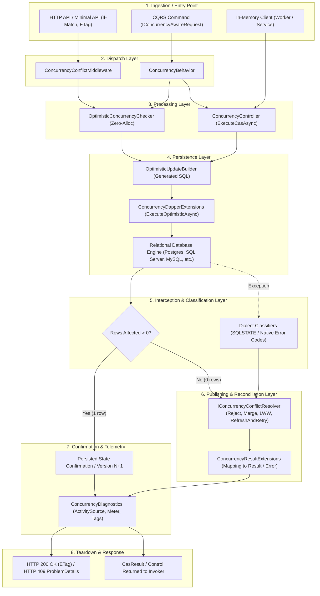
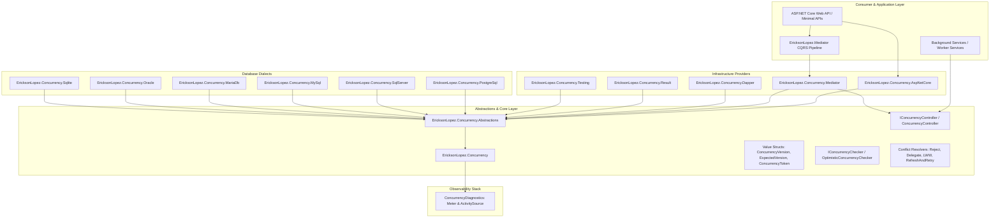
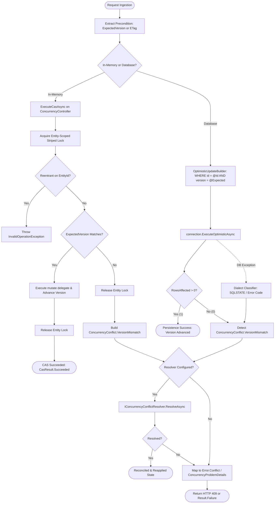
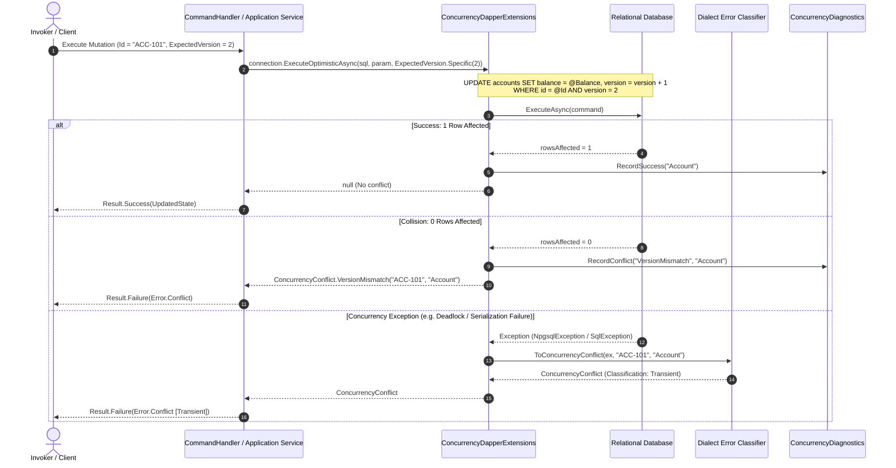
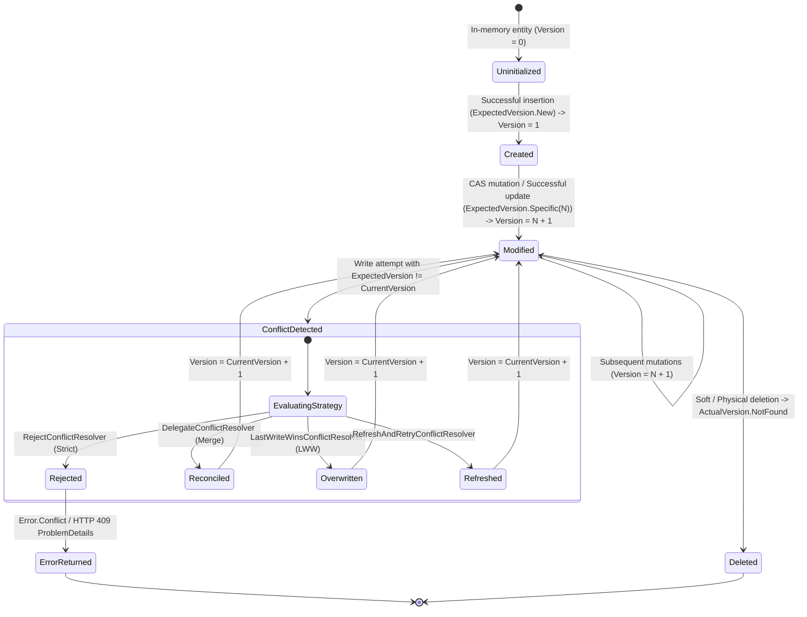
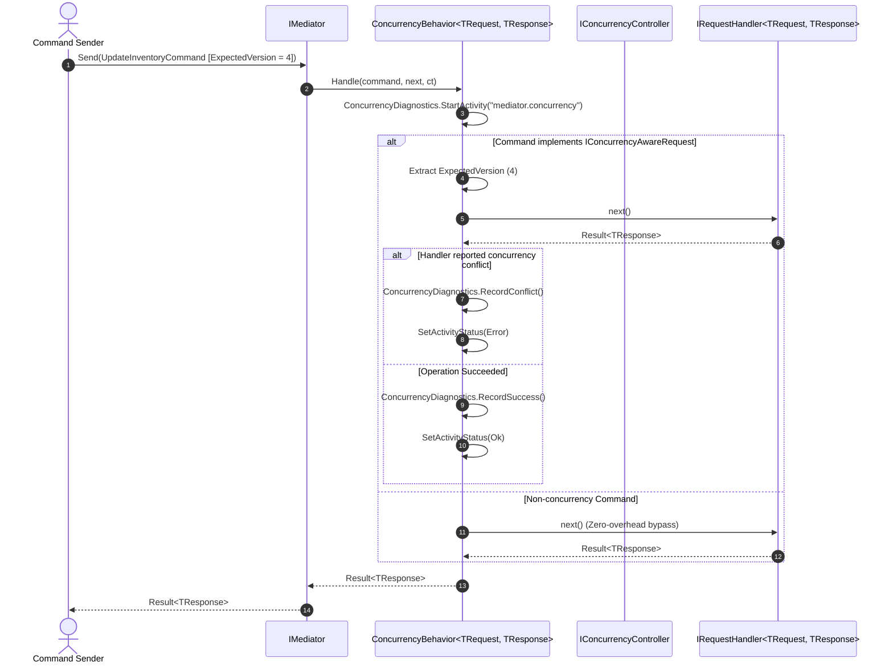
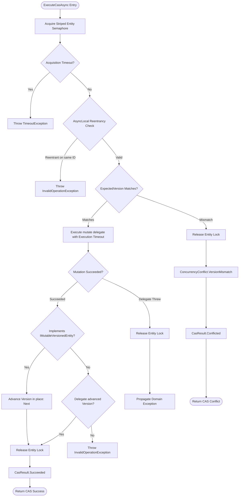
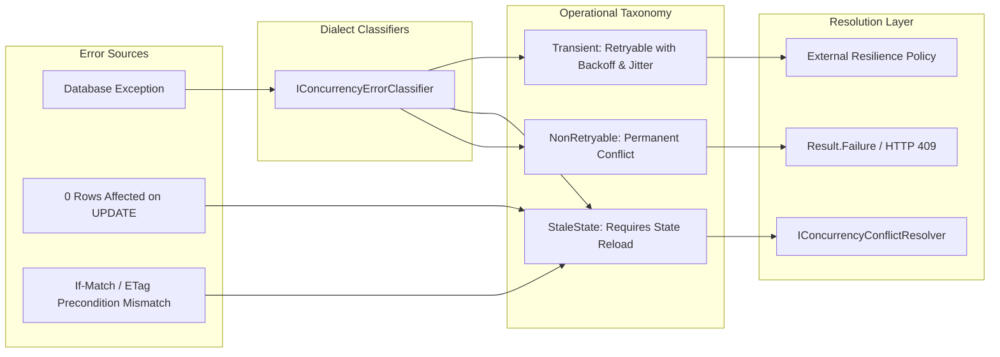

# Functional Architecture & Execution Flows

This document details the **Complete Functional Map**, layer transitions, and **Official Architectural Diagrams (Mermaid)** for the **`EricksonLopez.Concurrency`** ecosystem.

---

## 🗺️ Functional Map: Ingestion to Output

The ecosystem operates across 8 structured functional layers guaranteeing transactional integrity, lock-free optimistic conflict detection, and end-to-end distributed observability:

---

### Layer Transitions Explained

1. **Ingestion → Dispatch Layer**:
   - An HTTP request carries `If-Match: "<version>"` or a C# command implements `IConcurrencyAwareRequest`.
   - The dispatch layer (`ConcurrencyConflictMiddleware` or `ConcurrencyBehavior`) captures the precondition (`ExpectedVersion` or `ConcurrencyToken`) and activates an OpenTelemetry `Activity`.

2. **Dispatch → Processing Layer**:
   - For in-memory workflows, `ConcurrencyController.ExecuteCasAsync` acquires an entity-scoped striped lock (`RefCountedLock`), checks for reentrant calls via `AsyncLocal<ReentrancyNode>`, and verifies the expected version against the current entity version.
   - If preconditions fail, execution halts immediately without hitting the database infrastructure.

3. **Processing → Persistence Layer**:
   - `OptimisticUpdateBuilder` constructs a parameterized SQL statement: `UPDATE ... WHERE id = @Id AND version = @ExpectedVersion` (appending `tenant_id = @TenantId` in multi-tenant environments).
   - The query executes via Dapper's `ExecuteOptimisticAsync` in a single network roundtrip.

4. **Persistence → Interception & Classification Layer**:
   - If the database updates 1 row, the transaction succeeded.
   - If 0 rows are affected, a `ConcurrencyConflict.VersionMismatch` is synthesized.
   - If a database exception occurs (e.g. PostgreSQL `40001` serialization failure or `40P01` deadlock, SQL Server `1205`), the dialect classifier (`PostgreSqlConcurrencyErrorClassifier`, `SqlServerErrorClassifier`, etc.) extracts diagnostic metadata and produces a structured conflict record.

5. **Classification → Reconciliation & Publishing Layer**:
   - The conflict is categorized into an operational classification (`Transient`, `StaleState`, `NonRetryable`).
   - If an `IConcurrencyConflictResolver<TEntity>` is configured, it attempts resolution (`Reject`, `Delegate`, `LastWriteWins`, `RefreshAndRetry`).
   - Unresolved conflicts are translated into a `Result.Failure(Error.Conflict)` via `ConcurrencyResultExtensions`.

6. **Publishing → Confirmation, Teardown & Response**:
   - `ConcurrencyDiagnostics` records execution duration and emits telemetry metrics (`concurrency.successes` or `concurrency.conflicts`).
   - In ASP.NET Core, `ConcurrencyConflictMiddleware` catches unhandled `ConcurrencyException` instances and serializes them into RFC 7807 `ConcurrencyProblemDetails` with HTTP status 409 Conflict and an updated `ETag`.

---

## 🏛️ Architectural Diagrams (Mermaid)

### 1. General System Architecture

---

### 2. End-to-End Processing Flow

---

### 3. Sequence Diagram: Optimistic Verification & Dapper Persistence

---

### 4. State Diagram: Versioned Entity Lifecycle

---

### 5. Component Dependency Graph

```mermaid
graph TD
    subgraph CoreAndAbstractions [Core & Abstractions - Zero External Dependencies]
        Abs[EricksonLopez.Concurrency.Abstractions]
        Core[EricksonLopez.Concurrency]
        Abs --> Core
    end

    subgraph AdaptersAndIntegrations [Adapters & Infrastructure]
        DapperPkg[EricksonLopez.Concurrency.Dapper]
        ResultPkg[EricksonLopez.Concurrency.Result]
        MediatorPkg[EricksonLopez.Concurrency.Mediator]
        TestingPkg[EricksonLopez.Concurrency.Testing]
        AspNetCorePkg[EricksonLopez.Concurrency.AspNetCore]
    end

    subgraph DialectPackages [Dialect Classifiers]
        PG[EricksonLopez.Concurrency.PostgreSql]
        MSSQL[EricksonLopez.Concurrency.SqlServer]
        MySQL[EricksonLopez.Concurrency.MySql]
        MariaDB[EricksonLopez.Concurrency.MariaDb]
        Oracle[EricksonLopez.Concurrency.Oracle]
        SQLite[EricksonLopez.Concurrency.Sqlite]
    end

    subgraph ExternalLibraries [Ecosystem & Driver Dependencies]
        ExtDapper[Dapper]
        ExtResult[EricksonLopez.Result]
        ExtMediator[EricksonLopez.Mediator]
        ExtNpgsql[Npgsql]
        ExtSqlClient[Microsoft.Data.SqlClient]
        ExtMySql[MySqlConnector]
        ExtOracle[Oracle.ManagedDataAccess.Core]
        ExtSqlite[Microsoft.Data.Sqlite]
    end

    Abs --> DapperPkg
    Core --> DapperPkg
    DapperPkg --> ExtDapper

    Abs --> ResultPkg
    Core --> ResultPkg
    ResultPkg --> ExtResult

    Abs --> MediatorPkg
    Core --> MediatorPkg
    MediatorPkg --> ExtMediator

    Abs --> TestingPkg
    Abs --> AspNetCorePkg

    Abs --> PG
    Core --> PG
    PG --> ExtNpgsql

    Abs --> MSSQL
    MSSQL --> ExtSqlClient

    Abs --> MySQL
    MySQL --> ExtMySql

    Abs --> MariaDB
    MariaDB --> ExtMySql

    Abs --> Oracle
    Oracle --> ExtOracle

    Abs --> SQLite
    SQLite --> ExtSqlite
```

---

### 6. CQRS Pipeline with Mediator & `ConcurrencyBehavior`

---

### 7. In-Memory CAS Execution with Contention & Reentrancy Guards

---

### 8. Operational Error Handling & Classification Taxonomy

