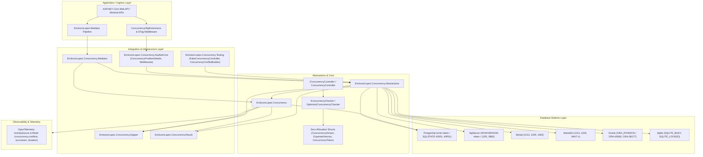
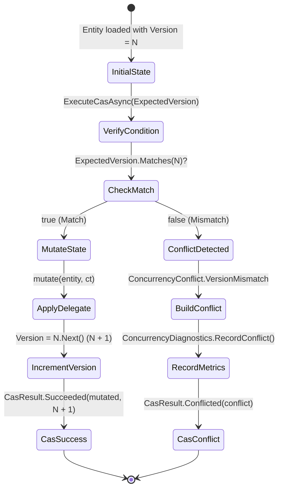
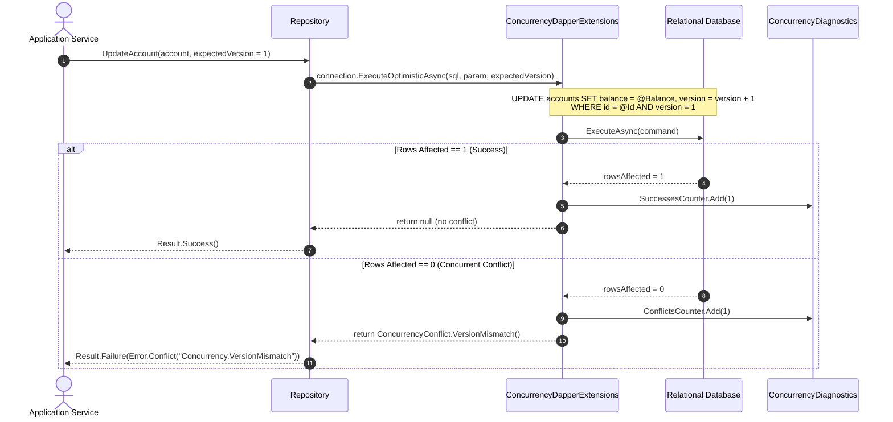
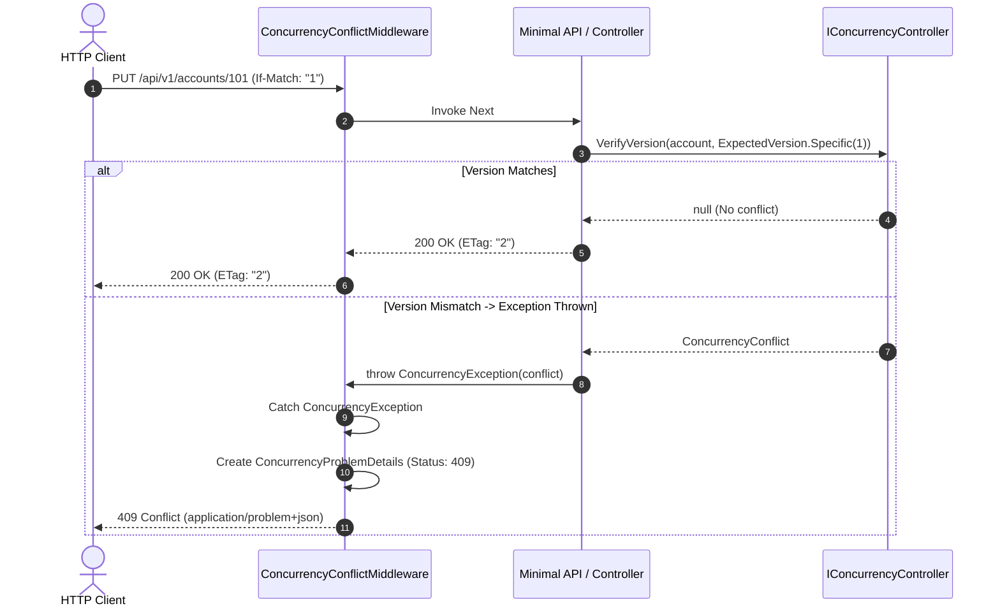
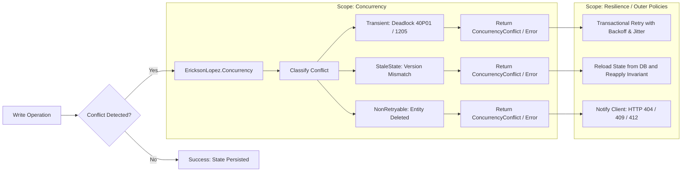

# Functional Architecture & Concurrency Flows

This document details the system architecture, execution flows, state transitions, and sequence diagrams for the **`EricksonLopez.Concurrency`** ecosystem.

---

## 🏛️ Overall Component Architecture

---

## 🔄 State Transition Flow (In-Memory Compare-And-Swap)

---

## 🗄️ Database Optimistic Write Sequence (Dapper Zero-Roundtrip)

---

## 🌐 ASP.NET Core RFC 7807 Conflict Handling Flow

---

## 🚦 Architectural Demarcation: Concurrency vs Resilience (ADR-001)

