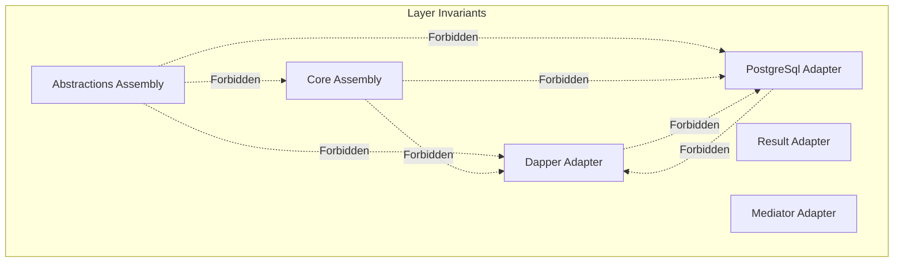

# Architecture Tests & Fitness Functions

## 1. Automated Architectural Governance

To enforce dependency isolation and prevent architectural decay across sprints, automated architecture fitness tests are implemented using `NetArchTest.Rules` and `AwesomeAssertions` in `EricksonLopez.Concurrency.ArchitectureTests`.



---

## 2. Enforced Architectural Invariants

1. **Abstractions Layer Purity**: `EricksonLopez.Concurrency.Abstractions` must not reference Core, Dapper, Result, Mediator, or any database drivers.
2. **Core Layer Isolation**: `EricksonLopez.Concurrency` must not reference Dapper, Result, Mediator, or database-specific drivers.
3. **Database Driver Segregation**:
   - `Npgsql` is permitted strictly inside `EricksonLopez.Concurrency.PostgreSql`.
   - `Microsoft.Data.SqlClient` is permitted strictly inside `EricksonLopez.Concurrency.SqlServer`.
   - `MySqlConnector` is permitted strictly inside `EricksonLopez.Concurrency.MySql` and `MariaDb`.
   - `Oracle.ManagedDataAccess.Core` is permitted strictly inside `EricksonLopez.Concurrency.Oracle`.
   - `Microsoft.Data.Sqlite` is permitted strictly inside `EricksonLopez.Concurrency.Sqlite`.
   - `Dapper` is permitted strictly inside `EricksonLopez.Concurrency.Dapper`.
4. **Namespace Standard**: All assembly names and root namespaces must conform to the canonical `EricksonLopez.Concurrency.*` naming convention.

---

## 3. Running Architecture Tests

```bash
dotnet test tests/EricksonLopez.Concurrency.ArchitectureTests/EricksonLopez.Concurrency.ArchitectureTests.csproj
```
