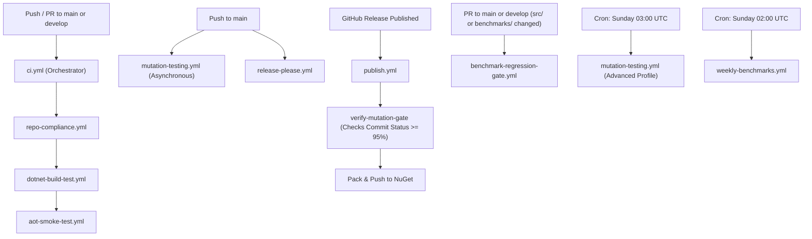

# CI/CD Pipeline

This document describes all GitHub Actions workflows in the `EricksonLopez.Concurrency` repository, their triggers, jobs, secrets, and dependencies.

---

## Pipeline Overview

---

## Workflows

### `ci.yml` — Continuous Integration Orchestrator

**File**: `.github/workflows/ci.yml`  
**Trigger**: `push` to `main` / `develop` (ignores `**.md` and `docs/**`); `pull_request` to `main` / `develop` (same path-ignore).

**Jobs** (sequential):
1. `compliance` — calls `repo-compliance.yml` (reusable)
2. `build-and-test` — calls `dotnet-build-test.yml` (reusable), requires `compliance` to pass
3. `aot-smoke-test` — calls `aot-smoke-test.yml` (reusable), requires `build-and-test` to pass

> **Note on PR Decoupling**: Pull Request CI exclusively runs fast checks (governance compliance, build, unit testing, code coverage, Native AOT smoke testing). It **never** runs Stryker mutation testing, preventing merge delays while ensuring rapid developer feedback.

**Secrets passed**:
- `SNK_KEY` — Strong Name Key (base64-encoded, optional)
- `CODECOV_TOKEN` — Codecov upload token (optional)

---

### `dotnet-build-test.yml` — Build, Test & Coverage

**File**: `.github/workflows/dotnet-build-test.yml`  
**Trigger**: `workflow_call` (from `ci.yml`), `workflow_dispatch`  
**Runner**: `ubuntu-latest`, timeout 30 min

**Steps**:
1. Checkout repository (`fetch-depth: 0` for full history)
2. Setup .NET SDKs: `8.0.x`, `9.0.x`, `10.0.x`
3. Restore Strong Name key from `SNK_KEY` secret (conditional, base64 decode)
4. `dotnet restore EricksonLopez.Concurrency.slnx`
5. `dotnet build` — Release configuration, no-restore
6. `dotnet test` — with Coverlet Code Coverage in Cobertura format → `./TestResults/`
7. Upload test results artifact (`test-results-{run_id}`, always)
8. Upload coverage to Codecov (using `CODECOV_TOKEN`, `fail_ci_if_error: false`)

**Artifacts produced**: `test-results-{run_id}` (test `.trx` and coverage XMLs)

**Secrets required**:
| Secret | Required | Purpose |
|---|---|---|
| `SNK_KEY` | No | Strong name signing (base64 `.snk` content) |
| `CODECOV_TOKEN` | No | Codecov coverage upload authentication |

---

### `aot-smoke-test.yml` — Native AOT Compilation & Execution

**File**: `.github/workflows/aot-smoke-test.yml`  
**Trigger**: `workflow_call` (from `ci.yml`), `workflow_dispatch`  
**Runner**: `ubuntu-latest`, timeout 20 min

**Steps**:
1. Checkout repository
2. Setup .NET 10 SDK (`10.0.x`)
3. Restore Strong Name key (conditional)
4. `dotnet publish` — `tests/EricksonLopez.Concurrency.AotSmokeTest/`, Release, `linux-x64`, `--self-contained`, output to `./aot-output/`
5. Execute the compiled native binary: `./aot-output/EricksonLopez.Concurrency.AotSmokeTest`

**Purpose**: Verifies that all published packages compile and execute without warnings when built as a self-contained Native AOT binary, confirming zero trimming violations.

**Secrets required**: `SNK_KEY` (optional)

---

### `repo-compliance.yml` — Repository Compliance Auditor

**File**: `.github/workflows/repo-compliance.yml`  
**Trigger**: `workflow_call` (from `ci.yml`), `workflow_dispatch`, `pull_request` to `main` / `develop`  
**Runner**: `ubuntu-latest`

**Steps**:
1. Checkout repository
2. Run `scripts/verify-compliance.ps1` using PowerShell

**Validated invariants** (8 checks):
1. All files in `docs/` use `kebab-case.md` naming
2. Zero `[Obsolete]` attribute usages in `src/`
3. Canonical MIT copyright header present in all `.cs` files
4. One top-level type per file in `src/`
5. `Directory.Build.props` references `ericksonlopezf/dotnet-concurrency`
6. `SECURITY.md` references the canonical email `ericksonlopezf@gmail.com`
7. Zero prohibited compiler warning suppressions (`CS1591`, `CS0618`, `CS0619`)
8. NuGet package icon metadata & asset presence in `Directory.Build.props`

---

### `mutation-testing.yml` — Stryker Mutation Testing (Deferred Quality Gate)

**File**: `.github/workflows/mutation-testing.yml`  
**Trigger**: `push` to `main` (paths-ignore: `**.md`, `docs/**`); `schedule` (every Sunday at 03:00 UTC); `workflow_dispatch` (with `level` tier profile choice).  
**Concurrency**: `mutation-testing-${{ github.workflow }}-${{ github.ref }}` (`cancel-in-progress: true` to prevent resource waste on superseded commits).  
**Runner**: `ubuntu-latest`, timeout 120 min per matrix job (accommodates deep multi-TFM mutation analysis without artificial terminations).

**Jobs**:
1. `setup` — Resolves dynamic package matrix based on the tier profile (`Basic`, `Standard`, `Advanced`).
2. `mutate` — Executes `dotnet-stryker` in parallel across packages (`fail-fast: false`), runs `scripts/record-stryker-result.js` to enforce break threshold ($\ge 95\%$), and uploads report and summary artifacts.
3. `finalize-gate` — Consolidates all package summaries via `scripts/consolidate-stryker-gate.js`, publishes a unified Step Summary, uploads `stryker-mutation-manifest-{sha}` artifact, and registers a GitHub Commit Status attestation (`quality-gate/stryker-mutation`).

**Tier Profiles**:
| Level | Included Packages | Target |
|---|---|---|
| `Basic` | `core`, `abstractions`, `result` | Fast foundational primitives validation (~10-15m) |
| `Standard` | `core`, `abstractions`, `result`, `mediator`, `dapper`, `testing`, `postgresql`, `sqlserver`, `sqlite` | Standard engine & popular DB adapters (~30-45m) |
| `Advanced` | All 13 ecosystem packages | Comprehensive ecosystem validation |

**Mutation Thresholds** (per `stryker-config.json`):
| Threshold | Value | Meaning |
|---|---|---|
| Break (Hard Gate) | 95% | Build fails and release blocked if $< 95\%$ |
| Low (Advisory) | 98% | Warning status below 98%, pass |
| High (Target) | 100% | Target mutation resistance |

---

### `benchmark-regression-gate.yml` — PR Benchmark Regression Check

**File**: `.github/workflows/benchmark-regression-gate.yml`  
**Trigger**: `pull_request` to `main` / `develop` when `src/**` or `benchmarks/**` changes; `workflow_dispatch` (with configurable threshold input)  
**Runner**: `ubuntu-latest`, timeout 45 min

**Steps**:
1. Checkout (full depth)
2. Setup .NET SDKs: `8.0.x`, `9.0.x`, `10.0.x`
3. Restore Strong Name key
4. `dotnet restore` and `dotnet build`
5. Run benchmarks on PR HEAD (short job, `--filter "*"`, `--runtimes net8.0 net10.0`, JSON exporter → `./benchmarks/pr-results/`)
6. Check for baseline JSON files in `benchmarks/results/`
7. If baseline exists: Python comparison script computes per-benchmark delta; regression detected if `delta_pct > threshold`
8. Post summary to GitHub Step Summary
9. Upload PR benchmark artifacts (retention: 30 days)

**Regression Threshold**: Default 10% (configurable via `workflow_dispatch` input).  
**Baseline Location**: `benchmarks/results/` (committed to repository by `weekly-benchmarks.yml`).

**Secrets required**: `SNK_KEY` (optional)

---

### `benchmarks.yml` — On-Demand Benchmark Run

**File**: `.github/workflows/benchmarks.yml`  
**Trigger**: `workflow_call` (reusable), `workflow_dispatch` (with optional `benchmark-filter` input)  
**Runner**: `ubuntu-latest`, timeout 60 min

**Steps**:
1. Checkout
2. Setup .NET SDKs: `8.0.x`, `9.0.x`, `10.0.x`
3. Restore Strong Name key
4. Build (Release)
5. Run benchmarks (short job, JSON + Markdown exporters → `./benchmarks/results/`)
6. Sync results from `BenchmarkDotNet.Artifacts/`
7. Upload benchmark results artifact (retention: 30 days)
8. Post Markdown summary to GitHub Step Summary

---

### `weekly-benchmarks.yml` — Weekly Full Benchmark Baseline

**File**: `.github/workflows/weekly-benchmarks.yml`  
**Trigger**: `schedule` (every Sunday at 02:00 UTC); `workflow_dispatch` (with optional `benchmark-filter` input)  
**Runner**: `ubuntu-latest`, timeout 120 min  
**Permissions**: `contents: write` (to commit results back to repository)

**Steps**:
1. Checkout (full depth, ref: current branch)
2. Setup .NET SDKs: `8.0.x`, `9.0.x`, `10.0.x`
3. Restore Strong Name key
4. Build (Release)
5. Run full benchmarks (`--runtimes net8.0 net9.0 net10.0`, JSON + Markdown exporters → `./benchmarks/results/`)
6. Upload results artifact (retention: 90 days)
7. Commit results back to `main` with `[skip ci]` tag if results changed

**Purpose**: Establishes the performance regression baseline used by `benchmark-regression-gate.yml`.

---

### `publish.yml` — Pack & Publish to NuGet (with Mutation Release Gate)

**File**: `.github/workflows/publish.yml`  
**Trigger**: `release: published` (GitHub Release event); `workflow_dispatch`  
**Runner**: `ubuntu-latest`

**Jobs**:
1. `verify-mutation-gate` — Executes `scripts/verify-release-mutation-gate.js` against the target commit SHA. Verifies that mutation testing on `main` passed ($\ge 95\%$). Blocks release if score $< 95\%$ or no test record exists.
2. `publish` — (Needs `verify-mutation-gate`) Packs and publishes `.nupkg` artifacts to NuGet.org.

**Secrets required**:
| Secret | Required | Purpose |
|---|---|---|
| `SNK_KEY` | No | Strong name signing |
| `NUGET_API_KEY` | Yes (for publish) | NuGet.org push authentication |

---

### `release-please.yml` — Semantic Release Automation

**File**: `.github/workflows/release-please.yml`  
**Trigger**: `push` to `main`  
**Permissions**: `contents: write`, `pull-requests: write`  
**Runner**: `ubuntu-latest`

**Steps**:
1. `googleapis/release-please-action@v4` with `release-type: simple`

**Purpose**: Automates GitHub Release creation and version bump pull requests based on Conventional Commit messages (e.g., `feat:`, `fix:`, `chore(release):`). When a release PR is merged, the action creates a GitHub Release, which triggers `publish.yml`.

---

## Secrets Reference

| Secret Name | Used By | Purpose | Required |
|---|---|---|---|
| `SNK_KEY` | `dotnet-build-test.yml`, `aot-smoke-test.yml`, `mutation-testing.yml`, `benchmark-regression-gate.yml`, `benchmarks.yml`, `weekly-benchmarks.yml`, `publish.yml` | Base64-encoded `.snk` strong name key content | No (signing skipped if absent) |
| `CODECOV_TOKEN` | `dotnet-build-test.yml` | Codecov coverage upload authentication | No (upload skipped if absent) |
| `NUGET_API_KEY` | `publish.yml` | NuGet.org package push | Yes (for live publish) |

---

## Branch Strategy

| Branch | CI | Mutation Testing | Release Please | Compliance |
|---|---|---|---|---|
| `main` | ✅ Push + PR target | ✅ Asynchronous deferred gate | ✅ Monitors pushes | ✅ PR target |
| `develop` | ✅ Push + PR target | ❌ (Targeted for main) | ❌ | ✅ PR target |
| `feature/*` | ✅ via PR | ❌ (Fast PR CI) | ❌ | ✅ via PR |
| `fix/*` | ✅ via PR | ❌ (Fast PR CI) | ❌ | ✅ via PR |
| `docs/*` | ❌ (md/docs ignored) | ❌ | ❌ | ✅ via PR |
