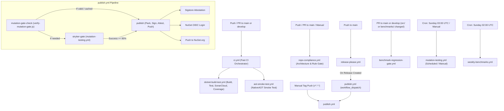

# CI/CD Pipeline

This document describes all GitHub Actions workflows in the `EricksonLopez.Concurrency` repository, their triggers, jobs, secrets, and dependencies.

---

## Pipeline Overview

---

## Workflows

### `ci.yml` — Continuous Integration Orchestrator

**File**: `.github/workflows/ci.yml`  
**Trigger**: `push` to `main` / `develop`; `pull_request` to `main` / `develop`.

**Jobs**:
1. `build-and-test` — calls `dotnet-build-test.yml` (reusable) with `artifact-name: test-results`.
2. `aot-smoke-test` — calls `aot-smoke-test.yml` (reusable).

> **Note on PR Decoupling**: Pull Request CI exclusively runs fast verification checks (build, test, coverage, SonarCloud, Native AOT smoke testing). It **never** executes full mutation testing on PR builds, preventing merge latency while providing rapid developer feedback.

**Secrets passed**:
- `SNK_KEY` — Strong Name Key (base64-encoded, optional)
- `CODECOV_TOKEN` — Codecov upload token (optional)
- `SONAR_TOKEN` — SonarCloud analysis token (optional)

---

### `dotnet-build-test.yml` — Build, Test, SonarCloud & Coverage

**File**: `.github/workflows/dotnet-build-test.yml`  
**Trigger**: `workflow_call` (from `ci.yml`), `workflow_dispatch`  
**Runner**: `ubuntu-latest`

**Steps**:
1. Checkout repository (`fetch-depth: 0` for full git history and SonarCloud analysis)
2. Setup .NET SDK: configurable (default `10.0.x`)
3. Restore Strong Name key from `SNK_KEY` secret (conditional, base64 decode to `EricksonLopez.snk`)
4. Setup Java 17 (Zulu distribution, required for SonarScanner)
5. Install `dotnet-sonarscanner` global tool
6. Begin Sonar analysis (if `SONAR_TOKEN` is present): targets project `ericksonlopezf_dotnet-concurrency`, organization `ericksonlopezf`, reports OpenCover paths
7. `dotnet build EricksonLopez.Concurrency.slnx --configuration Release`
8. `dotnet test` — with Coverlet Code Coverage emitting OpenCover and Cobertura formats to `./test-results/`
9. End Sonar analysis (if `SONAR_TOKEN` is present)
10. Upload test results artifact (`test-results`, always)
11. Upload coverage to Codecov using `codecov/codecov-action@v7.0.0` with `CODECOV_TOKEN`

**Artifacts produced**: `test-results` (test `.trx`, coverage reports)

**Secrets required**:
| Secret | Required | Purpose |
|---|---|---|
| `SNK_KEY` | No | Strong name signing (base64 `.snk` content) |
| `CODECOV_TOKEN` | No | Codecov coverage upload authentication |
| `SONAR_TOKEN` | No | SonarCloud project analysis authentication |

---

### `aot-smoke-test.yml` — Native AOT Compilation & Execution

**File**: `.github/workflows/aot-smoke-test.yml`  
**Trigger**: `workflow_call` (from `ci.yml`), `workflow_dispatch`  
**Runner**: `ubuntu-latest`, timeout 20 min

**Steps**:
1. Checkout repository
2. Setup .NET 10 SDK (`10.0.x`)
3. Restore Strong Name key (conditional)
4. `dotnet publish` — `tests/EricksonLopez.Concurrency.AotSmokeTest/`, Release, `linux-x64`, `--self-contained`, output to `./aot-output/`
5. Execute the compiled native binary: `./aot-output/EricksonLopez.Concurrency.AotSmokeTest`

**Purpose**: Verifies that all published packages compile and execute without warnings when built as a self-contained Native AOT binary, confirming zero trimming violations.

**Secrets required**: `SNK_KEY` (optional)

---

### `repo-compliance.yml` — Repository Compliance Auditor

**File**: `.github/workflows/repo-compliance.yml`  
**Trigger**: `push` to `main`, `pull_request` to `main`, `workflow_dispatch`  
**Runner**: `ubuntu-latest`, timeout 15 min

**Steps**:
1. Checkout repository
2. Setup .NET 10 SDK (`10.0.x`)
3. Run architecture & rules compliance script: `pwsh ./scripts/verify-compliance.ps1`
4. `dotnet restore EricksonLopez.Concurrency.slnx`
5. `dotnet build EricksonLopez.Concurrency.slnx --no-restore --configuration Release` (with strict diagnostics / `TreatWarningsAsErrors`)
6. `dotnet test EricksonLopez.Concurrency.slnx --no-build --configuration Release --verbosity normal --filter "FullyQualifiedName!~IntegrationTests"`
7. `dotnet pack EricksonLopez.Concurrency.slnx --no-build --configuration Release -o artifacts/`

**Validated invariants** (8 compliance checks in `verify-compliance.ps1`):
1. All files in `docs/` use `kebab-case.md` naming
2. Zero `[Obsolete]` attribute usages in `src/`
3. Canonical MIT copyright header present in all `.cs` files
4. One top-level type per file in `src/`
5. `Directory.Build.props` references `ericksonlopezf/dotnet-concurrency`
6. `SECURITY.md` references canonical email `ericksonlopezf@gmail.com`
7. Zero prohibited compiler warning suppressions (`CS1591`, `CS0618`, `CS0619`)
8. NuGet package icon metadata & asset presence in `Directory.Build.props`

---

### `mutation-testing.yml` — Stryker Mutation Testing (Deferred Quality Gate)

**File**: `.github/workflows/mutation-testing.yml`  
**Trigger**: `schedule` (every Sunday at 03:00 UTC); `workflow_dispatch` (with tier profile choice); `workflow_call` (invoked conditionally by `publish.yml` as pre-release quality gate).  
**Concurrency**: `mutation-testing-${{ github.workflow }}-${{ github.ref }}` (`cancel-in-progress: true`).  
**Runner**: `ubuntu-latest`, timeout 120 min per matrix job.

**Jobs**:
1. `setup` — Resolves dynamic package matrix based on tier profile (`Basic`, `Standard`, `Advanced`).
2. `mutate` — Executes `dotnet-stryker` in parallel across packages using dedicated per-package configuration files (`stryker-<package>-config.json`), runs `scripts/record-stryker-result.js` to enforce break threshold ($\ge 95\%$), and uploads report artifacts.
3. `finalize-gate` — Consolidates package summaries via `scripts/consolidate-stryker-gate.js`, publishes a unified Step Summary, uploads `stryker-mutation-manifest-{sha}` artifact, and registers a GitHub Commit Status attestation (`quality-gate/stryker-mutation`).

**Tier Profiles**:
| Level | Included Packages | Target |
|---|---|---|
| `Basic` | `core`, `abstractions`, `result` | Fast foundational primitives validation (~10-15m) |
| `Standard` | `core`, `abstractions`, `result`, `mediator`, `dapper`, `testing`, `postgresql`, `sqlserver`, `sqlite` | Standard engine & popular DB adapters (~30-45m) |
| `Advanced` | All 13 ecosystem packages | Comprehensive ecosystem validation |

**Mutation Thresholds** (per `stryker-*-config.json`):
| Threshold | Value | Meaning |
|---|---|---|
| Break (Hard Gate) | 95% | Build fails and release blocked if $< 95\%$ |
| Low (Advisory) | 98% | Warning status below 98%, pass |
| High (Target) | 100% | Target mutation resistance |

---

### `benchmark-regression-gate.yml` — PR Benchmark Regression Check

**File**: `.github/workflows/benchmark-regression-gate.yml`  
**Trigger**: `pull_request` to `main` / `develop` when `src/**` or `benchmarks/**` changes; `workflow_dispatch` (with configurable threshold input)  
**Runner**: `ubuntu-latest`, timeout 45 min

**Steps**:
1. Checkout (full depth)
2. Setup .NET SDKs: `8.0.x`, `9.0.x`, `10.0.x`
3. Restore Strong Name key
4. `dotnet restore` and `dotnet build`
5. Run benchmarks on PR HEAD (short job, `--filter "*"`, `--runtimes net8.0 net10.0`, JSON exporter → `./benchmarks/pr-results/`)
6. Check for baseline JSON files in `benchmarks/results/`
7. If baseline exists: Python comparison script computes per-benchmark delta; regression detected if `delta_pct > threshold`
8. Post summary to GitHub Step Summary
9. Upload PR benchmark artifacts (retention: 30 days)

**Regression Threshold**: Default 10% (configurable via `workflow_dispatch` input).  
**Baseline Location**: `benchmarks/results/` (committed to repository by `weekly-benchmarks.yml`).

---

### `weekly-benchmarks.yml` — Weekly Full Benchmark Baseline

**File**: `.github/workflows/weekly-benchmarks.yml`  
**Trigger**: `schedule` (every Sunday at 02:00 UTC); `workflow_dispatch` (with optional `benchmark-filter` input)  
**Runner**: `ubuntu-latest`, timeout 120 min  
**Permissions**: `contents: write` (to commit results back to repository)

**Steps**:
1. Checkout (full depth, ref: current branch)
2. Setup .NET SDKs: `8.0.x`, `9.0.x`, `10.0.x`
3. Restore Strong Name key
4. Build (Release)
5. Run full benchmarks (`--runtimes net8.0 net9.0 net10.0`, JSON + Markdown exporters → `./benchmarks/results/`)
6. Upload results artifact (retention: 90 days)
7. Commit results back to `main` with `[skip ci]` tag if results changed

**Purpose**: Establishes the performance regression baseline used by `benchmark-regression-gate.yml`.

---

### `publish.yml` — Pack, Attest & Publish to NuGet.org

**File**: `.github/workflows/publish.yml`  
**Trigger**: `push` tags `v*.*.*` (legacy manual tag push); `workflow_dispatch` (triggered automatically by `release-please.yml` or manual UI dispatch).  
**Permissions**: `id-token: write` (for NuGet OIDC and Sigstore attestation), `contents: write` (for GitHub Release creation), `attestations: write` (for build provenance), `statuses: read`, `actions: read`.  
**Runner**: `ubuntu-latest`

**Jobs**:
1. `mutation-gate-check` — Evaluates mutation quality gate on `main` via `scripts/verify-mutation-gate.js`. If cached status $\ge 95\%$, proceeds immediately; otherwise flags `needs_stryker: true`.
2. `stryker-gate` — Conditional execution of `mutation-testing.yml` with `mutation-level: "Standard"` if `needs_stryker == 'true'`.
3. `publish` — (Requires mutation quality gate to pass)
   - Resolves SemVer version from `inputs.version`, git tag, or `Directory.Build.props`.
   - Restores Strong Name key from `SNK_KEY` (conditional).
   - Executes full build and test suite with coverage upload to Codecov (`publish-gate` flag).
   - Packs all 13 `.csproj` packages to `./nupkgs/`.
   - Generates Sigstore Provenance Attestation via `actions/attest-build-provenance@v2.2.3`.
   - Logs into NuGet via OIDC using `NuGet/login@v1` (user: `ericksonlopezf`), retrieving an ephemeral `NUGET_API_KEY` token.
   - Pushes packages to `https://api.nuget.org/v3/index.json` with `--skip-duplicate`.
   - Creates GitHub Release with release notes and `.nupkg` assets (tag-triggered).

---

### `release-please.yml` — Semantic Release Automation

**File**: `.github/workflows/release-please.yml`  
**Trigger**: `push` to `main`  
**Permissions**: `contents: write`, `pull-requests: write`  
**Runner**: `ubuntu-latest`

**Steps**:
1. Executes `googleapis/release-please-action@v5.0.0` with `.release-please-config.json` and `.release-please-manifest.json`.
2. If release is created (`releases_created == 'true'`), automatically dispatches `publish.yml` via GitHub REST API with the newly created version.

---

## Secrets Reference

| Secret Name | Used By | Purpose | Required |
|---|---|---|---|
| `SNK_KEY` | All build workflows | Base64-encoded `.snk` strong name key content | No (signing skipped if absent) |
| `CODECOV_TOKEN` | `dotnet-build-test.yml`, `publish.yml` | Codecov coverage upload authentication | No (upload skipped if absent) |
| `SONAR_TOKEN` | `dotnet-build-test.yml` | SonarCloud static analysis authentication | No (analysis skipped if absent) |

> **Note on NuGet Authentication**: Static `NUGET_API_KEY` secrets are **not stored** in GitHub repository settings. The `publish.yml` workflow uses **NuGet Trusted Publishing via OIDC** (`NuGet/login@v1`, `id-token: write`), generating an ephemeral step output token for package publishing.

---

## Branch Strategy

| Branch | Fast CI | Mutation Testing | Release Please | Compliance |
|---|---|---|---|---|
| `main` | ✅ Push + PR target | ✅ Asynchronous deferred gate | ✅ Monitors pushes | ✅ Push + PR target |
| `develop` | ✅ Push + PR target | ❌ (Targeted for main) | ❌ | ❌ |
| `feature/*` | ✅ via PR | ❌ (Fast PR CI) | ❌ | ✅ via PR to main |
| `fix/*` | ✅ via PR | ❌ (Fast PR CI) | ❌ | ✅ via PR to main |
| `docs/*` | ❌ (md/docs ignored in CI) | ❌ | ❌ | ✅ via PR to main |
