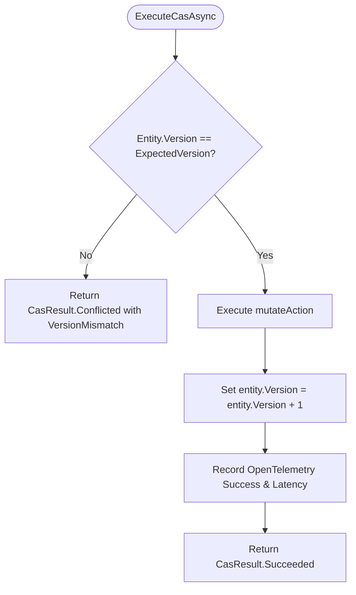

# Compare-And-Swap (CAS)

## 1. Overview & Mechanics

Compare-And-Swap (CAS) is an atomic synchronization primitive where a state change is performed **only if** the current state matches the expected version. If the condition holds, the state is updated and the version is automatically incremented.

`IConcurrencyController` provides an in-memory CAS execution mechanism:

```csharp
public ValueTask<CasResult<TEntity>> ExecuteCasAsync<TEntity>(
    TEntity entity,
    ExpectedVersion expectedVersion,
    string entityId,
    Func<TEntity, CancellationToken, ValueTask<TEntity>> mutateAction,
    CancellationToken cancellationToken = default)
    where TEntity : class, IVersionedEntity;
```



---

## 2. Usage Example

```csharp
public async Task<Result<BankAccount>> DepositMoneyAsync(
    BankAccount account,
    decimal amount,
    ExpectedVersion expectedVersion,
    CancellationToken ct)
{
    CasResult<BankAccount> casResult = await _concurrencyController.ExecuteCasAsync(
        account,
        expectedVersion,
        account.Id,
        (acc, cancellation) =>
        {
            acc.Balance += amount;
            return ValueTask.FromResult(acc);
        },
        ct);

    return casResult.ToResult();
}
```

---

## 3. Guarantees & Invariants

1. **Atomicity**: The verification, mutation, and version incrementation are executed atomically on the entity instance.
2. **Telemetry Integration**: Automatically creates an OpenTelemetry Activity `concurrency.cas.execute` and increments metric counters.
3. **Monadic Conversion**: Directly convert any `CasResult<T>` into an `EricksonLopez.Result<T>` via `.ToResult()`.
4. **`IMutableVersionedEntity` In-Place Mutation**: If the entity implements `IMutableVersionedEntity`, `ExecuteCasAsync` advances `entity.Version = entity.Version.Next()` automatically in place upon successful mutation. If immutable (`IVersionedEntity`), the mutation delegate is responsible for returning an updated instance with an incremented version.
5. **Fail-Fast Reentrancy Guards**: Nested or recursive calls to `ExecuteCasAsync` on the same `entityId` within the same asynchronous execution context are intercepted via `AsyncLocal<ReentrancyNode>` and immediately rejected with `InvalidOperationException` to eliminate deadlocks and prevent corruption of intermediate states.
6. **Bounded Contention & Timeouts**: In-memory mutual exclusion uses a zero-allocation `StripedLockPool` with reference-counted semaphores. Contention is strictly bounded by `ConcurrencyOptions.DefaultMaxAcquisitionTimeout` (10s) and `DefaultMaxExecutionTimeout` (30s), throwing `TimeoutException` when exceeded.
