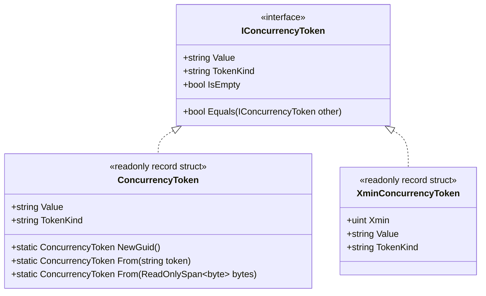

# Concurrency Tokens

## 1. Concept & Rationale

While numeric versions (`ConcurrencyVersion`) work well within relational domains, distributed architectures and public HTTP APIs frequently require **opaque concurrency tokens**. 

A `ConcurrencyToken`:
- Prevents clients from inferring entity mutation frequency or database internal sequence numbers.
- Encapsulates diverse underlying representations: HTTP `ETag`, GUIDs, cryptographic hashes, or database system columns (`xmin`).
- Implements `IConcurrencyToken` for uniform arbitration across different infrastructure providers.



---

## 2. Token Creation & Formats

### GUID-Based Token
```csharp
// Generates a cryptographically strong UUID token for REST ETag or external consumers
ConcurrencyToken token = ConcurrencyToken.NewGuid();
```

### Binary RowVersion / Timestamp Hash
```csharp
byte[] rowVersionBytes = [0x00, 0x00, 0x00, 0x01, 0xAA, 0xBB];
ConcurrencyToken token = ConcurrencyToken.From(rowVersionBytes);
// token.Value == "00000001AABB"
// token.TokenKind == "RowVersion"
```

### PostgreSQL System Column (`xmin`)
```csharp
uint xmin = 5432198;
XminConcurrencyToken token = new XminConcurrencyToken(xmin);
// token.Value == "5432198"
// token.TokenKind == "PostgreSql.xmin"
```

---

## 3. HTTP ETag / If-Match Integration

When exposing endpoints via ASP.NET Core Minimal APIs:
1. Provide `ETag: W/"<token.Value>"` in GET responses.
2. Read `If-Match: "<token.Value>"` in PUT/PATCH requests.
3. Validate using `OptimisticConcurrencyChecker.CheckToken(expectedToken, actualToken, ...)`.
4. Return `412 Precondition Failed` if a token mismatch is classified.
