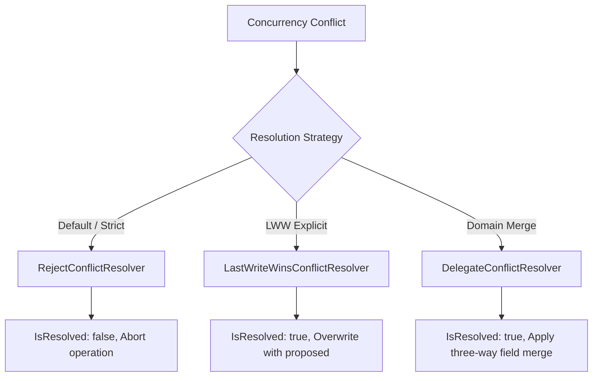

# Conflict Resolution Strategies

## 1. Resolution Contract

When a conflict arises, an application may choose to resolve it explicitly using `IConcurrencyConflictResolver<TEntity>`:

```csharp
public interface IConcurrencyConflictResolver<TEntity>
{
    ValueTask<ConflictResolution<TEntity>> ResolveAsync(
        TEntity proposedEntity,
        TEntity? currentDatabaseEntity,
        ConcurrencyConflict conflict,
        CancellationToken cancellationToken = default);
}
```

---

## 2. Standard Built-In Strategies



### 1. Reject (`RejectConflictResolver<T>`)
- **Default Strategy**: Fails fast and rejects the modification.
- Returns `ConflictResolution.Rejected<T>()`.
- Guarantees zero data loss and requires external arbitration.

### 2. Last-Write-Wins Explicit (`LastWriteWinsConflictResolver<T>`)
- Explicitly adopts the proposed entity, bypassing the conflict.
- **Warning**: Must only be enabled when data overwrites are acceptable by explicit business domain policy.

### 3. Domain-Specific Merge (`DelegateConflictResolver<T>`)
- Implements custom three-way merging (e.g., combining balance adjustments, appending audit items, or merging non-conflicting fields).

```csharp
var resolver = new DelegateConflictResolver<CustomerProfile>((proposed, current, conflict, ct) =>
{
    if (current is null)
    {
        return ValueTask.FromResult(ConflictResolution.Rejected<CustomerProfile>());
    }

    // Merge email from proposed, keep verified phone from current
    var merged = new CustomerProfile
    {
        Id = proposed.Id,
        Email = proposed.Email,
        PhoneNumber = current.PhoneNumber
    };

    return ValueTask.FromResult(ConflictResolution.Merged(merged, "Non-conflicting fields merged."));
});
```

---

## 3. Dependency Injection Configuration

```csharp
// Global default strategy:
services.AddEricksonLopezConcurrency(options =>
{
    options.DefaultResolutionStrategy = ConflictResolutionStrategy.Reject;
});

// Aggregate-specific custom resolver:
services.AddConflictResolver<CustomerProfile, CustomerProfileConflictResolver>();
```
