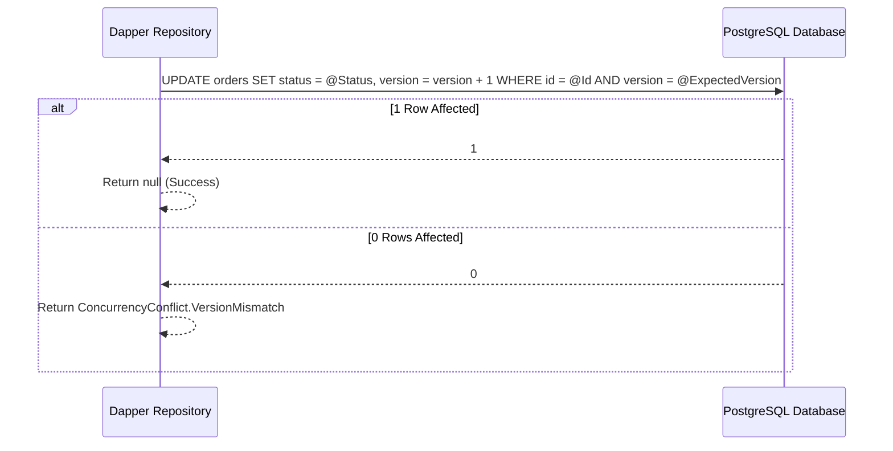

# Dapper Integration & Optimistic Updates

## 1. Zero-Roundtrip Optimistic Execution

`EricksonLopez.Concurrency.Dapper` provides asynchronous extension methods on `IDbConnection` that perform conditional optimistic updates and evaluate the rows affected count without performing extra round-trip queries.

```csharp
public static async Task<ConcurrencyConflict?> ExecuteOptimisticAsync(
    this IDbConnection connection,
    string sql,
    object? param,
    ExpectedVersion expectedVersion,
    string entityId,
    string entityType,
    IDbTransaction? transaction = null,
    int? commandTimeout = null,
    CancellationToken cancellationToken = default);
```



---

## 2. OptimisticUpdateBuilder

`OptimisticUpdateBuilder` generates standardized, injection-safe parameterized SQL statements for versioned updates:

```csharp
string sql = OptimisticUpdateBuilder.BuildVersionedUpdate(
    tableName: "orders",
    setClauses: "status = @Status, total = @Total",
    idColumn: "id",
    versionColumn: "version",
    tenantColumn: "tenant_id");

// Generated SQL:
// UPDATE orders SET status = @Status, total = @Total, version = version + 1 
// WHERE id = @Id AND tenant_id = @TenantId AND version = @ExpectedVersion;
```

---

## 3. End-to-End Repository Pattern

```csharp
public sealed class OrderRepository : IOrderRepository
{
    private readonly IDbConnection _connection;

    public OrderRepository(IDbConnection connection)
    {
        _connection = connection;
    }

    public async Task<Result<Order>> UpdateOrderAsync(Order order, ExpectedVersion expectedVersion, CancellationToken ct)
    {
        string sql = OptimisticUpdateBuilder.BuildVersionedUpdate(
            tableName: "orders",
            setClauses: "total = @Total, updated_at = @UpdatedAt",
            idColumn: "id",
            versionColumn: "version");

        ConcurrencyConflict? conflict = await _connection.ExecuteOptimisticAsync(
            sql: sql,
            param: new { order.Id, order.Total, UpdatedAt = DateTimeOffset.UtcNow, ExpectedVersion = (long)expectedVersion.Version },
            expectedVersion: expectedVersion,
            entityId: order.Id,
            entityType: nameof(Order),
            cancellationToken: ct);

        if (conflict is not null)
        {
            return Result<Order>.Failure(ConcurrencyErrors.FromConflict(conflict));
        }

        order.Version++;
        return Result<Order>.Success(order);
    }
}
```
