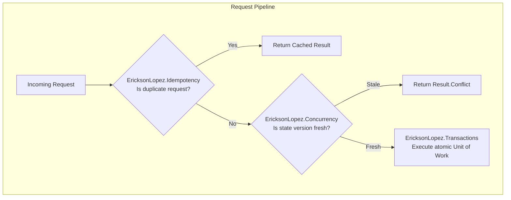

# Idempotency vs Concurrency

## 1. Responsibility Separation

---

## 2. Distinction Summary

- **Idempotency**: *"Is this the same request repeated?"* (Protects against network retries of identical operations).
- **Concurrency**: *"Is this operation modifying a state that has changed since it was read?"* (Protects against race conditions and stale writes).
