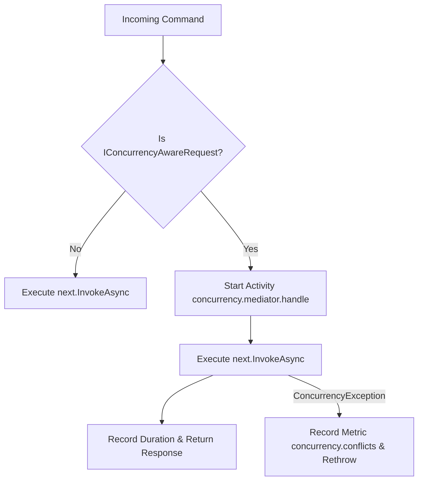

# Mediator Integration & Pipeline Behavior

## 1. Concurrency-Aware Mediator Requests

Commands declaring optimistic concurrency constraints implement `IConcurrencyAwareRequest` or `IConcurrencyAwareRequest<TResponse>`:

```csharp
public sealed record UpdateCustomerBalanceCommand(
    string CustomerId,
    decimal NewBalance,
    ExpectedVersion ExpectedVersion) : IConcurrencyAwareRequest<Result<CustomerDto>>
{
    ExpectedVersion? IConcurrencyAwareRequest.ExpectedVersion => ExpectedVersion;
}
```

---

## 2. ConcurrencyBehavior Pipeline

> [!IMPORTANT]
> **`ConcurrencyBehavior` is an OBSERVABILITY behavior, not a version enforcement middleware.**
>
> It does NOT automatically verify the `ExpectedVersion` from the request against the entity stored in the database or in memory. Version enforcement **must be performed explicitly** in the handler using `IConcurrencyController`.

`ConcurrencyBehavior<TRequest, TResponse>` is a `sealed class` implementing `IPipelineBehavior<TRequest, TResponse>` in `EricksonLopez.Mediator`. It operates on zero-allocation `INext<TResponse>` struct delegates, which eliminates async state machine allocations when no conflict is detected:

- Inspects the request for `IConcurrencyAwareRequest`.
- Starts an OpenTelemetry activity `concurrency.mediator.handle`.
- Attaches tags for `concurrency.expected_version` and `concurrency.expected_token`.
- Records pipeline execution duration in `concurrency.duration`.
- If downstream handlers throw a `ConcurrencyException`, records the conflict metric and tags the activity with `concurrency.conflict = true`.



---

## 3. Dependency Injection Registration

```csharp
services.AddMediator(cfg =>
{
    // Register standard mediator handlers
});

// Register concurrency pipeline behavior
services.AddConcurrencyMediatorBehavior();
```

---

## 4. Correct Version Enforcement in Handlers

Version enforcement must be done explicitly in the command handler using `IConcurrencyController`:

```csharp
public sealed class UpdateCustomerBalanceHandler
    : IHandler<UpdateCustomerBalanceCommand, Result<CustomerDto>>
{
    private readonly IConcurrencyController _concurrency;
    private readonly ICustomerRepository _repository;

    public UpdateCustomerBalanceHandler(
        IConcurrencyController concurrency,
        ICustomerRepository repository)
    {
        _concurrency = concurrency;
        _repository = repository;
    }

    public async ValueTask<Result<CustomerDto>> Handle(
        UpdateCustomerBalanceCommand command,
        CancellationToken cancellationToken)
    {
        CustomerAccount account = await _repository.GetByIdAsync(command.CustomerId, cancellationToken);

        // ← Explicit enforcement: the behavior does NOT do this automatically
        ConcurrencyConflict? conflict = _concurrency.VerifyVersion(
            account,
            command.ExpectedVersion,
            command.CustomerId);

        if (conflict is not null)
        {
            return Result<CustomerDto>.Failure(ConcurrencyErrors.FromConflict(conflict));
        }

        // Proceed with mutation...
        CasResult<CustomerAccount> cas = await _concurrency.ExecuteCasAsync(
            account,
            command.ExpectedVersion,
            command.CustomerId,
            (a, ct) => { a.Balance = command.NewBalance; return ValueTask.FromResult(a); },
            cancellationToken);

        if (cas.IsConflict)
        {
            return Result<CustomerDto>.Failure(ConcurrencyErrors.FromConflict(cas.Conflict!));
        }

        await _repository.UpdateAsync(cas.Entity!, cas.NewVersion, cancellationToken);
        return Result<CustomerDto>.Success(CustomerDto.From(cas.Entity!));
    }
}
```

> [!NOTE]
> The `ConcurrencyBehavior` will automatically record OpenTelemetry spans and conflict metrics when `ConcurrencyException` propagates up. For monadic flows using `EricksonLopez.Result`, the exception will not propagate — telemetry must be emitted manually or via the `ConcurrencyDiagnostics` static methods.
