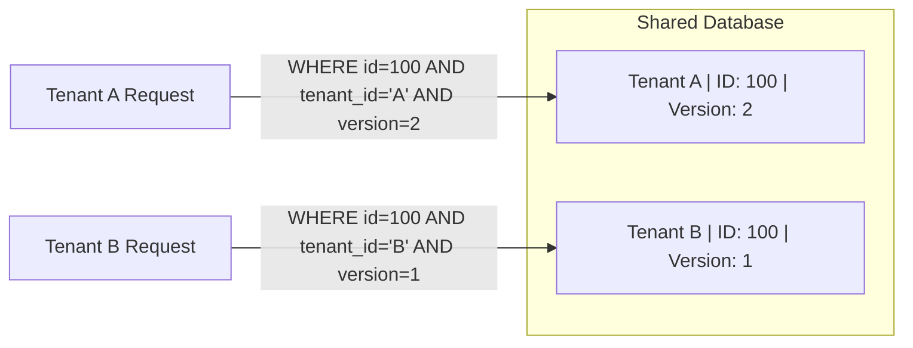

# Multi-Tenancy & Concurrency Isolation

## 1. Multi-Tenant Concurrency Isolation

In multi-tenant architectures, distinct tenants often share identical primary key formats or sequence numbering. `EricksonLopez.Concurrency` ensures that optimistic concurrency operations are strictly scoped to the active tenant.



---

## 2. Multi-Tenant SQL Building

`OptimisticUpdateBuilder` includes first-class support for `tenant_id` clauses in generated SQL statements:

```csharp
string sql = OptimisticUpdateBuilder.BuildVersionedUpdate(
    tableName: "invoices",
    setClauses: "status = @Status, amount = @Amount",
    idColumn: "invoice_id",
    versionColumn: "version",
    tenantColumn: "tenant_id",
    idParam: "InvoiceId",
    versionParam: "ExpectedVersion",
    tenantParam: "TenantId");

// Generated SQL:
// UPDATE invoices 
// SET status = @Status, amount = @Amount, version = version + 1 
// WHERE invoice_id = @InvoiceId AND tenant_id = @TenantId AND version = @ExpectedVersion;
```

---

## 3. PostgreSQL Row-Level Security (RLS) Compatibility

When using PostgreSQL RLS (`SET LOCAL app.current_tenant_id = @TenantId`):
- `EricksonLopez.Concurrency.Dapper` statements inherit the active RLS policy.
- An attempt by Tenant A to update a record belonging to Tenant B yields 0 rows affected, producing a safe `ConcurrencyConflict.VersionMismatch` or `StateDeleted` without leaking existence or sensitive data across tenant boundaries.
