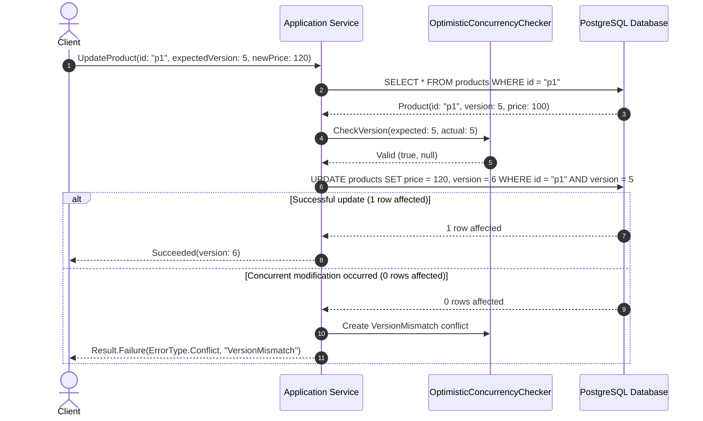

# Optimistic Concurrency Control

## 1. Fundamentals & Mechanism

Optimistic Concurrency Control (OCC) assumes that multiple transactions or operations can frequently complete without interfering with each other. Instead of acquiring heavy locks prior to reading or mutating data, the application checks whether another concurrent writer has updated the record during the operation lifetime.

In the `EricksonLopez` ecosystem, optimistic concurrency operates via two primary mechanisms:
1. **Numeric Version Counters**: `ConcurrencyVersion` and `ExpectedVersion`.
2. **Opaque Tokens**: `ConcurrencyToken` and `XminConcurrencyToken`.

---

## 2. In-Memory vs In-Database Verification

| Feature | In-Memory Verification (`OptimisticConcurrencyChecker`) | In-Database Verification (`Dapper / PostgreSQL`) |
|---|---|---|
| **Location** | Application Domain / Memory | Database Transaction Engine |
| **Execution Point** | Before applying business mutations | Atomic with the `UPDATE` SQL execution |
| **Failure Cost** | 0 database writes, zero wasted persistence overhead | 0 rows affected, rollback of local transaction |
| **Race Protection** | Fast rejection of stale commands | True serialized write arbitration across distributed nodes |

---

## 3. Best Practices

- Always declare `IVersionedEntity` on domain aggregate roots requiring update tracking.
- Pass `ExpectedVersion` explicitly in command DTOs from clients or message consumers.
- Pair in-memory validation with database-level conditional writes (`WHERE version = @ExpectedVersion`) for complete defense-in-depth.
