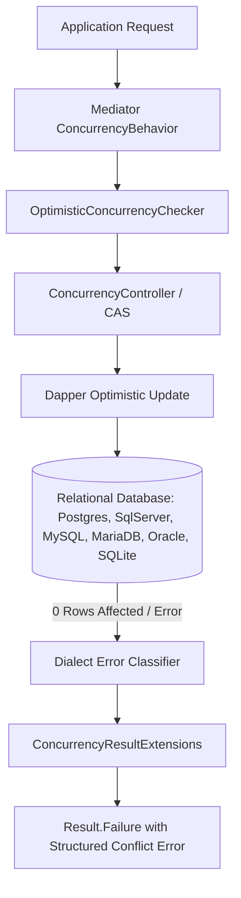

# EricksonLopez.Concurrency — System Overview

## 1. Executive Summary

`EricksonLopez.Concurrency` is the enterprise concurrency control and optimistic conflict arbitration framework for the **EricksonLopez** .NET 10 ecosystem. Built strictly on Clean Architecture, Domain-Driven Design (DDD), and Native AOT zero-reflection paradigms, it provides deterministic versioning, opaque concurrency tokens, compare-and-swap (CAS) primitives, and zero-roundtrip database conflict detection.

Unlike ad-hoc version checking or heavyweight ORM change tracking, `EricksonLopez.Concurrency` provides an explicit, allocation-free domain contract that enforces transactional integrity across high-throughput distributed microservices.

---

## 2. Core Capabilities & Architectural Pillars

| Capability | Technical Mechanism | Strategic Benefit |
|---|---|---|
| **Optimistic Concurrency** | Monotonically increasing `ConcurrencyVersion` and `ExpectedVersion` | Prevents lost updates without blocking database row locks. |
| **Opaque Concurrency Tokens** | `ConcurrencyToken` (ETag, GUID, hash, system xmin) | Protects distributed and RESTful endpoints without exposing internal database schema. |
| **Compare-And-Swap (CAS)** | In-memory atomic mutations with version incrementation | Guarantees deterministic state transitions in domain models before database persistence. |
| **Zero-Roundtrip SQL Conflict Detection** | Parameterized `WHERE version = @ExpectedVersion` with `rowsAffected` check | Detects concurrent modifications immediately on write without extra round-trip queries. |
| **Database Dialect Classifiers** | SQLSTATE & engine-specific error classification (Postgres, SqlServer, MySQL, MariaDB, Oracle, SQLite) | Translates database-level serialization failures into structured `ConcurrencyConflict` records. |
| **Ecosystem Synergy** | First-class integration with `Result`, `Mediator`, `MultiTenancy` | Seamless monadic error propagation, zero-allocation struct behaviors, and tenant isolation. |

---

## 3. Package Hierarchy & Dependency Boundaries

```mermaid
graph TD
    Abstractions[EricksonLopez.Concurrency.Abstractions]
    Core[EricksonLopez.Concurrency]
    Abstractions --> Core

    Core --> DapperPkg[EricksonLopez.Concurrency.Dapper]
    Core --> PgPkg[EricksonLopez.Concurrency.PostgreSql]
    Core --> MedPkg[EricksonLopez.Concurrency.Mediator]
    Core --> ResultPkg[EricksonLopez.Concurrency.Result]

    Abstractions --> DapperPkg
    Abstractions --> PgPkg
    Abstractions --> MedPkg
    Abstractions --> ResultPkg

    Abstractions --> TestingPkg[EricksonLopez.Concurrency.Testing]
    Abstractions --> AspNetCorePkg[EricksonLopez.Concurrency.AspNetCore]
    Abstractions --> SqlServerPkg[EricksonLopez.Concurrency.SqlServer]
    Abstractions --> MySqlPkg[EricksonLopez.Concurrency.MySql]
    Abstractions --> MariaDbPkg[EricksonLopez.Concurrency.MariaDb]
    Abstractions --> OraclePkg[EricksonLopez.Concurrency.Oracle]
    Abstractions --> SqlitePkg[EricksonLopez.Concurrency.Sqlite]

    ResultPkg --> ResultCore[EricksonLopez.Result]
    MedPkg --> MedCore[EricksonLopez.Mediator]
    DapperPkg --> DapperCore[Dapper]
    PgPkg --> NpgsqlCore[Npgsql]
    SqlServerPkg --> SqlClientCore[Microsoft.Data.SqlClient]
    MySqlPkg --> MySqlConnCore[MySqlConnector]
    MariaDbPkg --> MariaDbConnCore[MySqlConnector]
    OraclePkg --> OracleCore[Oracle.ManagedDataAccess.Core]
    SqlitePkg --> SqliteCore[Microsoft.Data.Sqlite]
```

The diagram below reflects the **actual `<ProjectReference>` declarations** in each `.csproj` file.

> **Note**: `AspNetCore`, `Testing`, `SqlServer`, `MySql`, `MariaDb`, `Oracle`, and `Sqlite` reference **only `Abstractions`** — they introduce no transitive dependency on the Core package. `Dapper`, `PostgreSql`, `Mediator`, and `Result` reference both `Abstractions` and `Core`.

---

## 4. Operational Boundaries

- **Concurrency vs Distributed Locks**: `EricksonLopez.Concurrency` does not implement Redis locks, SemaphoreSlim, or distributed mutexes. It is an optimistic detection and arbitration engine.
- **Concurrency vs Resilience**: `EricksonLopez.Concurrency` classifies conflicts (`Transient` vs `StaleState` vs `NonRetryable`). It does not automatically retry; retry policies are orchestrated by `EricksonLopez.Resilience` or the application layer.
- **Concurrency vs Transactions**: Concurrency validates state freshness; `EricksonLopez.Transaction` manages ACID unit-of-work boundaries.
- **Concurrency vs Idempotency**: Idempotency protects against duplicate incoming requests; Concurrency protects against concurrent mutations of stale entity state.
