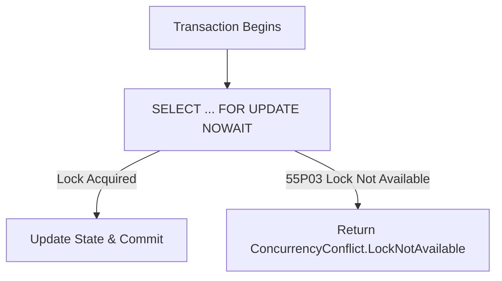

# Pessimistic Concurrency & Row-Level Locking

## 1. Role of Pessimistic Locking

While optimistic concurrency is the primary strategy across the `EricksonLopez` ecosystem, certain domain scenarios require immediate physical locking to serialize concurrent transactions (e.g., real-time balance debits or inventory reservation loops).



---

## 2. Multi-Engine Locking Helpers

`EricksonLopez.Concurrency` provides fluent SQL extensions for database-specific locking syntax across supported engines:

### PostgreSQL
```csharp
// Appends FOR UPDATE NOWAIT (fails fast if locked)
string pgSql = "SELECT * FROM accounts WHERE id = @Id"
    .WithLock(PostgreSqlLockMode.ForUpdateNoWait);

// Appends FOR UPDATE SKIP LOCKED (for worker queues)
string pgSkip = "SELECT * FROM jobs WHERE status = 'Pending' LIMIT 1"
    .WithLock(PostgreSqlLockMode.ForUpdateSkipLocked);
```

### SQL Server
```csharp
// Appends table hint WITH (UPDLOCK, ROWLOCK, NOWAIT)
string sqlServer = "accounts".WithSqlServerTableHint(SqlServerLockMode.UpdLockRowLockNowait);
```

### MySQL & MariaDB
```csharp
// MySQL: FOR UPDATE NOWAIT
string mySql = "SELECT * FROM orders WHERE id = @Id".WithMySqlLock(MySqlLockMode.ForUpdateNowait);

// MariaDB: FOR UPDATE WAIT 5
string mariaDb = "SELECT * FROM orders WHERE id = @Id".WithMariaDbLockWait(5);
```

### Oracle
```csharp
// Oracle: FOR UPDATE WAIT 10
string oracleSql = "SELECT * FROM orders WHERE id = @Id".WithOracleLockWait(10);
```

---

## 3. Boundary & Architectural Invariants

- **Distributed Locks are Excluded**: `EricksonLopez.Concurrency` does not implement Redis locks or distributed mutexes.
- **Pessimistic Locking is Infrastructure-Bound**: The domain model never directly invokes SQL locking statements.
