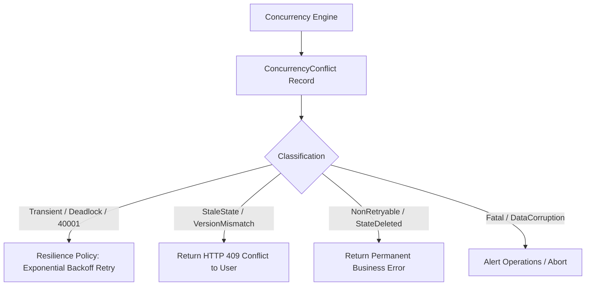

# Resilience Integration & Retry Boundaries

## 1. Architectural Invariant (ADR-001)

**`EricksonLopez.Concurrency` never automatically retries conflicts inside the core engine.**

The responsibility split is strictly enforced:
- **`EricksonLopez.Concurrency`**: Detects, models, and classifies conflicts (`Transient`, `Retryable`, `StaleState`, `NonRetryable`, `Fatal`).
- **Resilience Layer (`EricksonLopez.Resilience` / Polly)**: Evaluates the classification signal and orchestrates exponential backoff retries, circuit breakers, or caller rejection.



---

## 2. Classification Matrix for Resilience

| Classification | Meaning | Recommended Action | Example |
|---|---|---|---|
| `Transient` | Database-level contention or deadlock | **Retry with Jitter & Backoff** (max 3 attempts) | SQL Server 1205 Deadlock, PostgreSQL 40001 Serialization |
| `Retryable` | Conflict can be re-evaluated safely | **Reload state and retry** | Stale read on idempotent sync operation |
| `StaleState` | User edited out-of-date entity state | **Do NOT retry**; return HTTP 409 to user | Version mismatch on UI form submission |
| `NonRetryable`| Entity was deleted or archived | **Do NOT retry**; return 404/410/422 | `StateDeleted` conflict |
| `Fatal` | Corrupted concurrency token or constraint | **Do NOT retry**; raise critical alert | Data corruption, schema violation |

---

## 3. Concrete Code Recipes

### 3.1 Polly v8 (Resilience Pipelines) Integration

```csharp
using EricksonLopez.Concurrency.Abstractions;
using Polly;
using Polly.Retry;

public static class ConcurrencyResilienceExtensions
{
    public static ResiliencePipelineBuilder AddConcurrencyTransientRetry(
        this ResiliencePipelineBuilder builder,
        int maxRetries = 3)
    {
        return builder.AddRetry(new RetryStrategyOptions
        {
            ShouldHandle = new PredicateBuilder()
                .Handle<ConcurrencyException>(ex => 
                    ex.Conflict?.Classification == ConcurrencyConflictClassification.Transient),
            MaxRetryAttempts = maxRetries,
            BackoffType = DelayBackoffType.Exponential,
            UseJitter = true,
            Delay = TimeSpan.FromMilliseconds(50)
        });
    }
}
```

### 3.2 Executing Handlers within a Resilience Pipeline

```csharp
public sealed class TransferFundsCommandHandler
{
    private readonly ResiliencePipeline _resiliencePipeline;
    private readonly IConcurrencyController _concurrencyController;
    private readonly IAccountRepository _repository;

    public async Task<Result<Unit>> Handle(TransferFundsCommand command, CancellationToken ct)
    {
        return await _resiliencePipeline.ExecuteAsync(async token =>
        {
            var account = await _repository.GetByIdAsync(command.AccountId, token);
            
            var casResult = await _concurrencyController.ExecuteCasAsync(
                account,
                command.ExpectedVersion,
                command.AccountId,
                (acc, t) => { acc.Withdraw(command.Amount); return ValueTask.FromResult(acc); },
                token);

            if (casResult.IsConflict)
            {
                // Throw ConcurrencyException so Polly can evaluate whether to retry
                throw new ConcurrencyException(casResult.Conflict!);
            }

            await _repository.UpdateAsync(casResult.Entity!, token);
            return Result.Success(Unit.Value);
        }, ct);
    }
}
```
